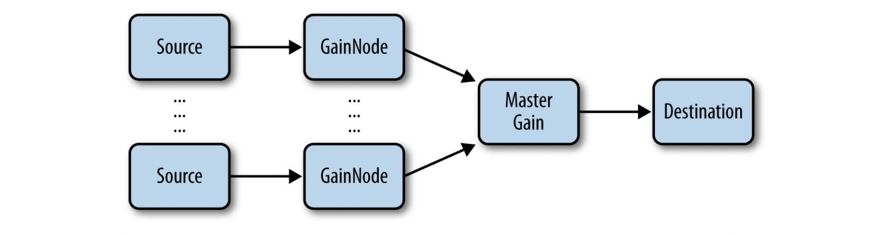
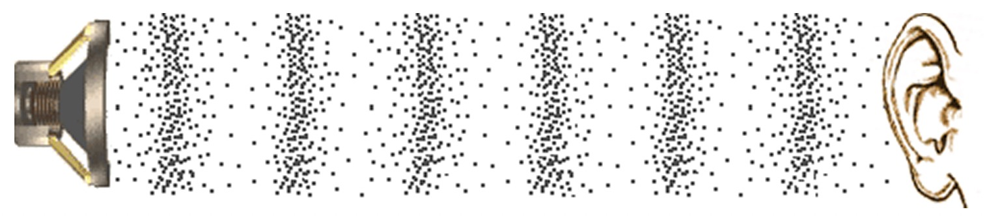
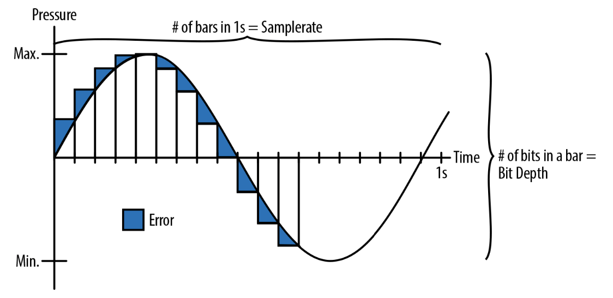

# Fundamentals
This chapter will describe how to get started with the Web Audio API, which brows‐ ers are supported, how to detect if the API is available, what an audio graph is, what audio nodes are, how to connect nodes together, some basic node types, and finally, how to load sound files and playback sounds.


# 基础

此章将描述从何处入手 Web Audio API, 哪些浏览器支持，如何检测哪些 API 可用，什么是音频可视化，音频节点是什么，如何将音频节点组合连接在一起，介绍一些基础的音频节点类型，最后加载音频并播放


## A Brief History of Audio on the Web
The first way of playing back sounds on the web was via the <bgsound> tag, which let website authors automatically play background music when a visitor opened their pages. This feature was only available in Internet Explorer, and was never standar‐ dized or picked up by other browsers. Netscape implemented a similar feature with the <embed> tag, providing basically equivalent functionality.
Flash was the first cross-browser way of playing back audio on the Web, but it had the significant drawback of requiring a plug-in to run. More recently, browser vendors have rallied around the HTML5 <audio> element, which provides native support for audio playback in all modern browsers.
Although audio on the Web no longer requires a plug-in, the <audio> tag has signifi‐ cant limitations for implementing sophisticated games and interactive applications. The following are just some of the limitations of the <audio> element:

• No precise timing controls
• Very low limit for the number of sounds played at once
• No way to reliably pre-buffer a sound
• No ability to apply real-time effects
• No way to analyze sounds

## Audio 音频在 Web中的历史简介

最早在网页中播放音频使用的是 <bgsound> 标签，当有人访问网页时，网页创作者使用此标签就可自动播放背景音频。这个特性只能 IE 浏览器上可用，它从未被标准化或被其它浏览器所实现过。网景浏览器实现了一个类似的 <embed> 标签, 提供了基本类似的播放功能。

Flash 最早在网页中实现了跨浏览器播放音频的功能，但它有个比较大的缺点就是需要以插件方式运行。最近浏览器开发商都围绕在 HTML5 <audio> 标签，在现代浏览器上此标签提供了原生播放音频的能力。

尽管在网页上播放音频不再需要插件了，但 <audio> 标签在实现一些复杂的游戏和交互性应用时还是有些显著的限制，一些限制如下：

* 没有精确定时可控
* 一次可播放的音频数量太少
* 没能可靠的预缓冲能力
* 无法应用实时音频特效
* 没有可用的方法对音频进行分析


There have been several attempts to create a powerful audio API on the Web to address some of the limitations I previously described. One notable example is the Audio Data API that was designed and prototyped in Mozilla Firefox. Mozilla’s approach started with an <audio> element and extended its JavaScript API with addi‐ tional features. This API has a limited audio graph (more on this later in “The Audio Context” on page 3), and hasn’t been adopted beyond its first implementation. It is currently deprecated in Firefox in favor of the Web Audio API.

他们多次尝试推出强大的 audio API 来解决我以上面提到的音频限制。其中值得注意的就是火狐浏览器设计的 Audio Data API 原型实现。Mozilla 试图用 <audio> 标签对其 Javascript API 进行扩展额外的特性。此 API 在音频的可视化上有限制(更多信息我将在第3章的" The Audio Context" 介绍)，它并未在后续超越 <audio> 的实现。此 API 现已被火狐浏览器放弃


In contrast with the Audio Data API, the Web Audio API is a brand new model, com‐ pletely separate from the <audio> tag, although there are integration points with other web APIs (see Chapter 7). It is a high-level JavaScript API for processing and synthesizing audio in web applications. The goal of this API is to include capabilities found in modern game engines and some of the mixing, processing, and filtering tasks that are found in modern desktop audio production applications. The result is a versatile API that can be used in a variety of audio-related tasks, from games, to inter‐ active applications, to very advanced music synthesis applications and visualizations.

相比于 Audio Data API,  Web Audio API 使用了全新的模式，完全独立于 <audio> 标签的实现，尽管有些点与其它 web API 有混合（详见第7章）。它在 web 应用中提供了更高级的 Javascript API 用于处理和混合音频。此 API 的目的是实现现代游戏所需的能力，包括混音、处理、滤镜特效等这些在现代桌面应用程序产品所能提供的能力。最终结果是一个多功能的 API 可以被用于多样的处理音频相关的任务，从游戏到可交互应用，到高级音频合成应用与可视化。


## Games and Interactivity
Audio is a huge part of what makes interactive experiences so compelling. If you don’t believe me, try watching a movie with the volume muted.
Games are no exception! My fondest video game memories are of the music and sound effects. Now, nearly two decades after the release of some of my favorites, I still can’t get Koji Kondo’s Zelda and Matt Uelmen’s Diablo soundtracks out of my head. Even the sound effects from these masterfully-designed games are instantly recogniz‐ able, from the unit click responses in Blizzard’s Warcraft and Starcraft series to sam‐ ples from Nintendo’s classics.


## 游戏与交互

音频是交互体验的重要组成部分。如果你不信，试着观看一部关掉音频的电影。

在游戏中更是如此！我最爱的电子游戏令我记忆最深的就是其中的音乐与音效。就算过了将近20年，塞尔达和暗黑破坏神的音效在我的脑海中仍然挥之不去。
甚至从暴雪的《魔兽争霸》和《星际争霸》系列中的圈点士兵音效到任天堂经典游戏中的各种音效，这些精心设计的游戏音效立马就可以被识别出来。


Sound effects matter a great deal outside of games, too. They have been around in user interfaces (UIs) since the days of the command line, where certain kinds of errors would result in an audible beep. The same idea continues through modern UIs, where well-placed sounds are critical for notifications, chimes, and of course audio and video communication applications like Skype. Assistant software such as Google Now and Siri provide rich, audio-based feedback. As we delve further into a world of ubiquitous computing, speech- and gesture-based interfaces that lend themselves to screen-free interactions are increasingly reliant on audio feedback. Finally, for visu‐ ally impaired computer users, audio cues, speech synthesis, and speech recognition are critically important to create a usable experience.

音效在游戏外的应用也同样重要。它们在命令行工具内交互之始就被应用于 UI 交互，当输出出错时就发出“哔”的一声。同样它被应用现代交互 UI 上，一般用于提醒功能，铃声，当然也应用于音视频通讯比如 Skype。像 Google Now 和 Siri 这样的助手软件同样提供了丰富的音效反馈。当我们深入发掘这个世界，通用计算设备，语音和手势交互等可脱离屏幕的交互方式更加的依赖于音频的反馈。最后，对于视障视弱的计算机用户来说，音频提示，语音合成与识别提供了最主要的用户体验原则


Interactive audio presents some interesting challenges. To create convincing in-game music, designers need to adjust to all the potentially unpredictable game states a player can find herself in. In practice, sections of the game can go on for an unknown duration, and sounds can interact with the environment and mix in complex ways, requiring environment-specific effects and relative sound positioning. Finally, there can be a large number of sounds playing at once, all of which need to sound good together and render without introducing quality and performance penalties.

可交互的音频也代表着一些有趣的挑战。为了创建合适的游戏音频，设计师需要调整好游戏玩家所有不可预知的状态。在实践中，游戏中某部分的时长可能是未知的，音效与周边环境交互产生更复杂的混音，需要环境特效音且取决于相关的音频位置。最终可能同一时刻播放着一堆音频，全都得保证组合在一起的音效即保证质量又不影响渲染性能


## The Audio Context
The Web Audio API is built around the concept of an audio context. The audio con‐ text is a directed graph of audio nodes that defines how the audio stream flows from its source (often an audio file) to its destination (often your speakers). As audio passes through each node, its properties can be modified or inspected. The simplest audio context is a connection directly form a source node to a destination node

An audio context can be complex, containing many nodes between the source and destination (Figure 1-2) to perform arbitrarily advanced synthesis or analysis.

Figures 1-1 and 1-2 show audio nodes as blocks. The arrows represent connections between nodes. Nodes can often have multiple incoming and outgoing connections. By default, if there are multiple incoming connections into a node, the Web Audio API simply blends the incoming audio signals together.

The concept of an audio node graph is not new, and derives from popular audio frameworks such as Apple’s CoreAudio, which has an analogous Audio Processing Graph API. The idea itself is even older, originating in the 1960s with early audio environments like Moog modular synthesizer systems.


## Audio Context

Web Audio API 是建立在 audio context 音频上下文的概念之上的。音频上下文是描述音频所有节点的，这些节点定义了音频流是如何从起点(一般是音频文件)到目的地(一般就是你的扬声器)。当音频通过每个节点时，音频的属性可被修改也可被查验。最简单的音频上下文就是起始节点到结束节点的直连如图 1-1


图 1-1

一个音频上下文可能会非常复杂，在音频的起点与结束节点之间包含众多的音频节点（图1-2）进行任意众多的高级合成或分析。

图 1-1 和 1-2 方块表示音频节点。箭头代表节点之间的连接。这些节点经常拥有众多的输入和输出连接。默认情况下，如果一个音频节点拥有多个输入源，Web Audio API 会简单的混成一个音频信号。

音频节点图的概念并不新鲜，它来源于一些流行的音频处理框架，如 Apple 的 CoreAudio, 它提供了类似的音频处理 图像 API。它本身的概念很久远了，可追溯到1960年代的早期处理音频，比如 Moog 模块化混成系统（Moog modular synthesizer systems）。


图 1-2


## Initializing an Audio Context
The Web Audio API is currently implemented by the Chrome and Safari browsers (including MobileSafari as of iOS 6) and is available for web developers via JavaScript. In these browsers, the audio context constructor is webkit-prefixed, meaning that instead of creating a new AudioContext, you create a new webkitAudioContext. However, this will surely change in the future as the API stabilizes enough to ship un- prefixed and as other browser vendors implement it. Mozilla has publicly stated that they are implementing the Web Audio API in Firefox, and Opera has started partici‐ pating in the working group.
With this in mind, here is a liberal way of initializing your audio context that would include other implementations (once they exist):


A single audio context can support multiple sound inputs and complex audio graphs, so generally speaking, we will only need one for each audio application we create. The audio context instance includes many methods for creating audio nodes and manipu‐ lating global audio preferences. Luckily, these methods are not webkit-prefixed and are relatively stable. The API is still changing, though, so be aware of breaking changes (see Appendix A).

## 初始化音频上下文

Web Audio API 现已被 Chrome 和 Safari 浏览器实现（包含 IOS 6 手机版 Safari ）并且通过 JavaScript 开放给了 网页开发者。在这些浏览器上，音频上下文创建时需要加上 webkit 前缀，你不能直接使用 `new AudioContext` 而应该使用 `new webkitAudioContext` 创建。然而在未来在 API 足够稳定且多数浏览器供应商都实现了后前缀可去掉。Mozilla 已宣布在火狐浏览器上实现 Web Audio API，Opera 也开始参与进工作组。记得这一点即可，下面是通用的写法可兼容后期（一旦其它浏览器供应商也实现）：

```
var contextClass = (window.AudioContext || window.webkitAudioContext || window.mozAudioContext || window.oAudioContext || window.msAudioContext);
if (contextClass) {
  // Web Audio API is available. var context = new contextClass();
} else {
  // Web Audio API is not available. Ask the user to use a supported browser.
}
```

一个音频上下文即可支持多个音频的输入与复杂的音频图谱，一般来讲，一个应用使用一个音频上下文即可。音频上班文件的实例包含了众多的方法用于创建音频节点以及操作全局音频属性。幸运的是这些方法不需要加前缀，且相对稳定。 API 仍在变更，所以还是要小心会有大的变化。


## Types of Web Audio Nodes
One of the main uses of audio contexts is to create new audio nodes. Broadly speak‐ ing, there are several kinds of audio nodes:
Source nodes
Sound sources such as audio buffers, live audio inputs, <audio> tags, oscillators, and JS processors
Modification nodes
Filters, convolvers, panners, JS processors, etc.
Analysis nodes
Analyzers and JS processors
Destination nodes
Audio outputs and offline processing buffers

Sources need not be based on sound files, but can instead be real-time input from a live instrument or microphone, redirection of the audio output from an audio ele‐ ment [see “Setting Up Background Music with the <audio> Tag” on page 53], or entirely synthesized sound [see “Audio Processing with JavaScript” on page 51]. Though the final destination-node is often the speakers, you can also process without sound playback (for example, if you want to do pure visualization) or do offline pro‐ cessing, which results in the audio stream being written to a destination buffer for later use.


## 音频节点的类型

音频上下文主要的一个功能就是创建新的音频节点。广义上来讲，一般包含以下几个节点类型：

* 源节点（Source nodes）
  音源，如音频缓冲，直播音频输入，<audio> 标签， 振荡器，以及 JS 处理器

* 修饰节点（Modification nodes）
  Filters, convolvers, panners, JS 处理器 等等

* 分析节点（Analysis nodes）
  分析器， JS 处理器
  
* 结束节点（Destination nodes）
  音频输出和结束处理缓存

音频源不限于音频文件，可用直播音频流或麦克风，<audio> 标签内的输出也可以 ，或者整个都是合成音频。尽管最终结束节点一般都是扬声器，不播放音频的情况下你也可以处理(例如，你只希望直接对音频进行可视化)或离线处理，成音频流保存起来用于后续使用。


## Connecting the Audio Graph
Any audio node’s output can be connected to any other audio node’s input by using the connect() function. In the following example, we connect a source node’s output into a gain node, and connect the gain node’s output into the context’s destination:


Note that context.destination is a special node that is associated with the default audio output of your system. The resulting audio graph of the previous code looks like Figure 1-3.


Once we have connected up a graph like this we can dynamically change it. We can disconnect audio nodes from the graph by calling node.disconnect(outputNumber). For example, to reroute a direct connection between source and destination, circum‐ venting the intermediate node, we can do the following:

## 连接音频图

使用 connect() 方法可以将任意音频节点输出连接至任意其它的音频节点。在以下例子，我们连接了音源节点的输出到 gain 节点，并将其输出连接到了结束节点：

```
// Create the source.
var source = context.createBufferSource(); // Create the gain node.
var gain = context.createGain();
// Connect source to filter, filter to destination.
source.connect(gain);
gain.connect(context.destination);
```

注意，`context.destination` 是一个特殊的节点，一般为系统的默认音频输出。上述代码形成的音频图如下 1-3：


图 1-3

一旦像上面这样我们连接了音频图就可以动态改变它。我们可以调用 `node.disconnect(outputNumber)` 来断开节点连接。例如，重新直连源音频节点至结束音频节点，避开中间 gain 节点 代码如下：

```
source.disconnect(0);
gain.disconnect(0);
source.connect(context.destination);
```


## Power of Modular Routing
In many games, multiple sources of sound are combined to create the final mix. Sour‐ ces include background music, game sound effects, UI feedback sounds, and in a multiplayer setting, voice chat from other players. An important feature of the Web Audio API is that it lets you separate all of these different channels and gives you full control over each one, or all of them together. The audio graph for such a setup might look like Figure 1-4.

We have associated a separate gain node with each of the channels and also created a master gain node to control them all. With this setup, it is easy for your players to control the level of each channel separately, precisely the way they want to. For exam‐ ple, many people prefer to play games with the background music turned off.

## 模块化路由的力量
在很多游戏中，通常多个音源最终混成一个。这些音源包含了背景音乐，游戏音效，UI反馈音，在多人游戏中还有其它玩家的聊天音频。Web Audio API 的一个非常重要的特性就是它允许你单独且完整的控制某个音或者组合在一起控制。音频图看起来应该像下面这样图 1-4：



我们分别使用 gain 音频节点将分开的声道音源联合在一起，并使用一个主 gain 节点来控制它们。 通过这样的设置，非常方便按需精准控制单独的声道级别。例如，非常多的用户在玩游戏过程中更喜欢把背景音关掉。


## CRITICAL THEORY What Is Sound?

In terms of physics, sound is a longitudinal wave (sometimes called a pressure wave) that travels through air or another medium. The source of the sound causes molecules(分子，微粒) in the air to vibrate and collide with one another. This causes regions of high and low pressure, which come together and fall apart in bands. If you could freeze time and look at the pattern of a sound wave, you might see something like Figure 1-5.

Mathematically, sound can be represented as a function, which ranges over pressure values across the domain of time. Figure 1-6 shows a graph of such a function. You can see that it is analogous to Figure 1-5, with high values corresponding to areas with dense（稠密） particles (high pressure), and low values corresponding to areas with sparse （稀疏）particles (low pressure).


Electronics dating back (追溯) to the early twentieth century made it possible for us to capture and recreate sounds for the first time. Microphones take the pressure wave and convert it into an electric signal, where (for example) +5 volts corresponds to the highest pressure and −5 volts to the lowest. Conversely, audio speakers take this voltage and convert it back into the pressure waves that we can hear.

Whether we are analyzing sound or synthesizing it, the interesting bits for audio programmers are in the black box in Figure 1-7, tasked with manipulating the audio signal. In the early days of audio, this space was occupied by analog filters and other hardware that would be considered archaic(过时) by today’s standards. Today, there are modern digital equivalents for many of those old analog pieces of equipment. But before we can use software to tackle the fun stuff, we need to represent sound in a way that computers can work with.

## 重要理论：什么是声音？

就物理上而言，声音是一种纵波（有时也被称为压力波）它们通过空气或其它媒介传播。 音源产生是由于空气内分子之间的振动与碰撞。它们的聚散导致了不同区域的高低压。如果你有能力冻结时间那么就可以观察到声波图像，可能类似于图 1-5



图 1-5

数学上来讲，声音可被表示为函数，通过时间轴上的压力范围值。 图 1-6 展示了函数图像。 可以看到它模拟的是图 1-5 ，值高的地方表示粒子稠密的区域（高压），值低则表示粒子稀疏的区域（低压）

首次捕获并重建声音的能力得追溯到20世纪初了。麦克风捕获压力波并转化成电子信号，（举例）用 +5 伏电压代表最高压，-5 伏电压代表最低压。与之相反，音频播放器获取这些电压并将其转换回压力波，这样我们才能听到。

无论我们是在分析声音还是合成声音, 对于音频编程者来说感兴趣的比特信息都在黑盒内操作音频信号图 1-7 。早期操作音频这个空间被模拟滤波器和其他硬件占据，按照今天的标准，这些硬件会被认为是过时的。现在有更多数字处理设备代替老的模拟设备。但在使用软件处理音频前，我们需要先将声音转换成电脑能处理的信息


图 1-7 声音的记录与回放


## CRITICAL THEORY What Is Digital Sound?
We can do this by time-sampling the analog signal at some frequency, and encoding the signal at each sample as a number. The rate at which we sample the analog signal is called the sample rate. A common sample rate in many sound applications is 44.1 kHz. This means that there are 44,100 numbers recorded for each second of sound. The numbers themselves must fall within some range. There is generally a certain number of bits allocated to each value, which is called the bit depth. For most recorded digital audio, including CDs, the bit depth is 16, which is generally enough for most listeners. Audiophiles prefer 24-bit depth, which gives enough precision that people’s ears can’t hear the difference compared to a higher depth.
The process of converting analog signals into digital ones is called quantization (or sampling) and is illustrated in Figure 1-8.

In Figure 1-8, the quantized digital version isn’t quite the same as the analog one because of differences between the bars and the smooth line. The difference (shown in blue) decreases with higher sample rates and bit depths. However, increasing these values also increases the amount of storage required to keep these sounds in memory, on disk, or on the Web. To save space, telephone systems often used sample rates as low as 8 kHz, since the range of frequencies needed to make the human voice intelligible is far smaller than our full audible-frequency range.
By digitizing sound, computers can treat sounds like long arrays of numbers. This sort of encoding is called pulse-code modulation (PCM). Because computers are so good at processing arrays, PCM turns out to be a very powerful primitive for most digital-audio applications. In the Web Audio API world, this long array of numbers representing a sound is abstracted as an AudioBuffer. AudioBuffers can store multiple audio channels (often in stereo, meaning a left and right channel) represented as arrays of floating-point numbers normalized between −1 and 1. The same signal can
also be represented as an array of integers, which, in 16-bit, range from (−215) to (215 − 1).


## 重要理论：什么是数字声音？

我们可以这样做，对模拟信号进行一定频率的按时间采样，对每个信号进行编码编成一个数字。 对模拟信号的采样被称为采样率。一般音频软件处理通常采样率为44.1kHz。这意味着每一秒对声音进行记录 44100 个数值。这些数值限定在某个范围内。每个值通常分配一定数量的位，称为位深度(bit depth)。对于大多数数字音频录制，包括CD，位深度 16 对于大多数人来说足够了。

对于音乐发烧友来说，24位深度也够了，已经有足够的精度，使用再高的位深度人耳已很难区别开来了。

模拟信号转数字信号被称为数字化(或采样)，可抽象为 图 1-8



图 1-8 

在图 1-8 ，数字化信号的版本的长条与模拟信号版本光滑的曲线看起来区别非常大。随着采样率增高与采样深度的增加区别会越来越小（蓝色部分）。然而这些值的增加也意谓着更多存储内空间的付出。为了节约空间，电话系统通常使用的采样率低至 8 kHz, 因为使人类声音清晰可听的频率范围远远小于我们可听到的全部频率范围.

对于声音的数字化，计算机通常会像对待长数字的数组一样处理。这样的编码被称为脉冲编码调制PCM。因为计算机非常立善于处理数组，PCM对于大多数数字音频应用来说是一个非常强大的基元。在 Web Audio API 的世界，长数字的数组的声音被表示为音频缓冲(AudioBuffer). 音频缓冲可以存储多条音频通道(通常在立体声中，包含左声道和右声道)被表示为标准化从 -1 到 1 后的浮点数数组。同样的信号当然也可以被表示为整形数组，在 16 位长度下，范围从 -215 至 215 - 1。

## CRITICAL THEORY Audio Encoding Formats
Raw audio in PCM format is quite large, which uses extra memory, wastes space on a hard drive, and takes up extra bandwidth when downloaded. Because of this, audio is generally stored in compressed formats. There are two kinds of compression: lossy and lossless. Lossless compression (e.g., FLAC) guarantees that when you compress and then uncompress a sound, the bits are identical. Lossy audio compression (e.g., MP3) exploits features of human hearing to save additional space by throwing out bits that we probably won’t be able to hear anyway. Lossy formats are generally good enough for most people, with the exception of some audiophiles.

A commonly used metric for the amount of compression in audio is called bit rate, which refers to the number of bits of audio required persecond of playback. The higher the bit rate, the more data that can be allocated per unit of time, and thus the less compression required. Often, lossy formats, such as MP3, are described by their bit rate (common rates are 128 and 192 Kb/s). It’s possible to encode lossy codecs at arbitrary bit rates. For example, telephone-quality human speech is often compared to 8 Kb/s MP3s. Some formats such as OGG support variable bit rates, where the bit rate changes over time. Be careful not to confuse this concept with sample rate or bit depth [see “What Is Sound?” on page 7]!

Browser support for different audio formats varies quite a bit. Generally, if the Web Audio API is implemented in a browser, it uses the same loading code that the <audio> tag would, so the browser support matrix for <audio> and the Web Audio API is the same. Generally, WAV (which is a simple, lossless, and typically uncompressed format) is supported in all browsers. MP3 is still patent-encumbered, and is therefore not available in some purely open source browsers (e.g., Firefox and Chro‐ mium). Unfortunately, the less popular but patent-unencumbered OGG format is still not available in Safari at the time of this writing.
For a more up-to-date roster of audio format support, see http://mzl.la/13kGelS.

## 重要理论：音频编码格式

原始的音频 PCM 格式非常巨大, 它会造成额外的存储浪费，在下载时也会造成额外的带宽浪费。正因如此，音频通常会存储为压缩后的格式。有两种类型的压缩方式：有损压缩和无损压缩。无损压缩（如, FLAC）保证在压缩与解压后比特位信息完全相同。有损压缩(如，MP3) 利用人类听觉特性会丢弃掉部人类听不到的分比特位信息用于节约存储空间。有损压缩对于大多数人来说足够使用了。当然音乐发烧友除外。

通常度量音频压缩量被称作比特率，它代表着重放每秒音频所需要的比特位数量。比特率越高单位时间内可利用的数据就越多所需的压缩就越少(更精确)。通常有损压缩格式，比如 MP3 定义为它们的比特率（一般为 128 到 192 Kb/s）。有损格式的编解码有可能使用任意的比特率。举个例子，电话人声音频通常使用 8Kb/s MP3s格式。一些格式支持可变比特率如 OGG 格式。比特率会随着时间变化而变。注意此处的比特率别和采样率或比特深度混淆了

浏览器对不同音频格式的支持差别很大。一般来说，如果是在浏览器上， Web Audio API 的实现与 <audio> 标签的实现是一样的。一般来说 WAV(一种简单的无损压缩格式)格式所有浏览器都支持。 MP3 仍然有专利阻碍，因为在一些纯开源的浏览器上不支持（比如，Firefox, Chromium）。不幸的是，不太流行但无专利阻碍的 OGG 格式在我写这篇文章时Safari 还是不支持。更多格式信息可查看这里 http://mzl.la/13kGelS

## Loading and Playing Sounds

Web Audio API makes a clear distinction between buffers and source nodes. The idea of this architecture is to decouple the audio asset from the playback state. Taking a record player analogy, buffers are like records and sources are like playheads, except in the Web Audio API world, you can play the same record on any number of playheads simultaneously（同时地）! Because many applications involve multiple versions of the same buffer playing simultaneously, this pattern is essential. For example, if you want multiple bouncing ball sounds to fire in quick succession(接踵而来，紧接着), you need to load the bounce buffer only once and schedule multiple sources of playback [see “Multiple Sounds with Variations” on page 32].
To load an audio sample into the Web Audio API, we can use an XMLHttpRequest and process the results with context.decodeAudioData. This all happens asynchronously and doesn’t block the main UI thread:

Audio buffers are only one possible source of playback. Other sources include direct input from a microphone or line-in device or an <audio> tag among others (see Chapter 7).

Once you’ve loaded your buffer, you can create a source node (AudioBufferSource Node) for it, connect the source node into your audio graph, and call start(0) on the source node. To stop a sound, call stop(0) on the source node. Note that both of these function calls require a time in the coordinate system of the current audio context (see Chapter 2):

Games often have background music playing in a loop. However, be careful about being overly repetitive with your selection: if a player is stuck in an area or level, and the same sample continuously plays in the background, it may be worthwhile to gradually fade out the track to prevent frustration. Another strategy is to have mixes of various intensity that gradually （逐渐地）crossfade into one another depending on the game situation [see “Gradually Varying Audio Parameters” on page 16].

## 声音的加载与播放

Web Audio API 将缓冲与音源节点区别的很清晰。这样的架构有利于解构音频资源与播放状态。以唱片机为例，缓冲区就像唱片，而源就像播放指针，而在 Web Audio API 的世界中你可以同时在多个播放指针处播放同一个唱片。由于许多应用程序涉及同一缓冲区的多个版本同时播放，因此这种模式是必不可少的。举个例子，
如果您希望快速连续地发出多个弹跳球的声音，则只需要加载一次弹跳缓冲并安排多个播放源。

在 Web Audio API 加载一个音频样本，我们可以使用一个 XMLHttpRequest 加载并对加载的结果用`context.decodeAudioData`进行音频解码处理。这些都是异步的不会阻塞主 UI 进程：

```
var request = new XMLHttpRequest(); 
request.open('GET', url, true); 
request.responseType = 'arraybuffer';
// Decode asynchronously
request.onload = function() {
  context.decodeAudioData(request.response, function(theBuffer) { 
    buffer = theBuffer;
  }, onError);
}
request.send();
```

音频缓冲只是播放源的一种。其它播放源包括直接来自麦克风或其它音源输入设备，或者 <audio> 标签等等（见第7章）。

一旦你加载了缓冲，你可以为它创建一个(source node)源节点(AudioBufferSource Node)，把它连接到音频图并在源节点(source node)调用 `start(0)`。结束播放调用 `stop(0)`.注意，这两个函数在当前音频上下文的坐标系统调用都需要消耗时间（见第2章）

```
function playSound(buffer) {
  var source = context.createBufferSource(); 
  source.buffer = buffer; 
  source.connect(context.destination); 
  source.start(0);
}
```

游戏中通常都有循环播放的背景音乐。然而，需要注意不要过度重复你的选择：如果玩家被困在了某地或某个关卡，同样的样本在背景中不断播放，为了防止玩家沮丧，背景音声道的逐渐淡出可能是值得考虑的。另一种策略是根据游戏情境将不同强度的元素混合在一起（文章后续会提到）。


## Putting It All Together
As you can see from the previous code listings, there’s a bit of setup to get sounds playing in the Web Audio API. For a real game, consider implementing a JavaScript abstraction around the Web Audio API. An example of this idea is the following BufferLoader class. It puts everything together into a simple loader, which, given a set of paths, returns a set of audio buffers. Here’s how such a class can be used:


## 将它们整合在一起

如你所见以上的代码，Web Audio API 需要一些初始化的程序设置。在真正的游戏中，可以考虑围绕 Web Audio API 执行 JavaScript 抽象。例如后续的 BufferClass 类。它将所有东西都整合进一个简单的加载器上，加载器提供了设置路径，返回音频缓冲的功能。以下是如何使用 BufferLoader 类的代码：


```
window.onload = init; 
var context;
var bufferLoader;
function init() {
  context = new webkitAudioContext();
  bufferLoader = new BufferLoader( context,
            [
              '../sounds/hyper-reality/br-jam-loop.wav',
              '../sounds/hyper-reality/laughter.wav',
            ],
            finishedLoading
        );
  bufferLoader.load();
}

function finishedLoading(bufferList) {
    // 创建两具音源并把它们整合到一起播放
    var source1 = context.createBufferSource();
    var source2 = context.createBufferSource(); 
    source1.buffer = bufferList[0];
    source2.buffer = bufferList[1];
    source1.connect(context.destination);
    source2.connect(context.destination);
    source1.start(0);
    source2.start(0);
}
```
BufferLoader 类的实现可参考此处 http://webaudioapi.com/samples/shared.js


