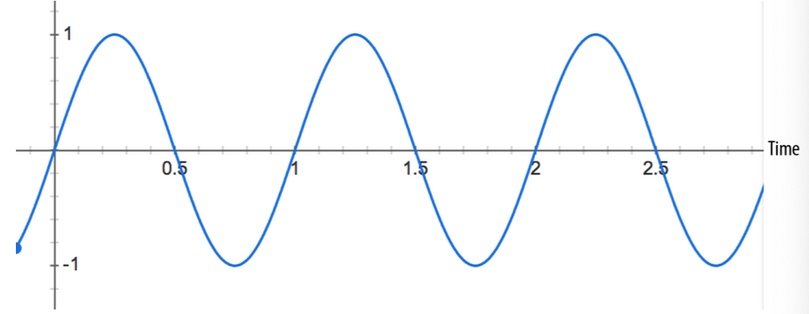

# Perfect Timing and Latency

One of the strengths of the Web Audio API as compared to the <audio> tag is that it comes with a low-latency precise-timing model.
Low latency is very important for games and other interactive applications since you often need fast auditory(听觉的，听力的) response to user actions. If the feedback is not immediate, the user will sense the delay, which will lead to frustration. In practice, due to imperfections of human hearing, there is leeway for a delay of up to 20 ms or so, but the number varies depending on many factors.
Precise timing enables you to schedule events at specific times in the future. This is very important for scripted scenes and musical applications.

# 完美的时机和延迟

相较于 <audio> 标签 Web Audio API 拥有低延迟精确定时模型。 

低延时对于游戏或交互式应用来说非常重要，因为交互操作时要快速响应给用户听觉。如果响应的不及时，用户就会察觉到延时这种体验相当不好。

在实践中，由于人类听觉的不完美，延迟的余地可达20毫秒左右，但具体延迟多少取决于许多因素。精确的可控时间使得能够在未来的特定时间安排事件。这对于脚本场景和音乐应用来说非常重要

## Timing Model
One of the key things that the audio context provides is a consistent timing model and frame of reference for time. Importantly, this model is different from the one used for JavaScript timers such as setTimeout, setInterval, and new Date(). It is also different from the performance clock provided by window.performance.now().

All of the absolute times that you will be dealing with in the Web Audio API are in seconds (not milliseconds!), in the coordinate system of the specified audio context. The current time can be retrieved from the audio context via the currentTime property. Although the units are seconds, time is stored as a floating-point value with high precision.


## 时间模型
其中一个重要的点是，音频上下文提供了一致的计时模型和时间的帧率。重要的是此模型有别于我们常用的 Javascript 脚本所用的计时器 如 setTimeout, setInterval, new Date()。也有别于 window.performance.now()提供的性能分析时钟

在 Web Audio API 音频上下文系统坐标中所有你打交道的的绝对时间单位是秒而不是毫秒。当前时间可通过音频上下文的 currentTime 属性获取。同样它也是秒为单位，时间存储为高精度的浮点数存储。


## Precise Playback and Resume
The start() function makes it easy to schedule precise sound playback for games and other time-critical applications. To get this working properly, ensure that your sound buffers are pre-loaded [see “Loading and Playing Sounds” on page 10]. Without a pre-loaded buffer, you will have to wait an unknown amount of time for the browser to fetch the sound file, and then for the Web Audio API to decode it. The failure mode in this case is you want to play a sound at a precise instant, but the buffer is still loading or decoding.

Sounds can be scheduled to play at a precise time by specifying the first (when) parameter of the start() call. This parameter is in the coordinate system of the AudioContext’s currentTime. If the parameter is less than the currentTime, it is played immediately. Thus start(0) always plays sound immediately, but to schedule sound in 5 seconds, you would call start(context.currentTime + 5).

Sound buffers can also be played from a specific time offset by specifying a second parameter to the start() call, and limited to a specific duration with a third optional parameter. For example, if we want to pause a sound and play it back from the paused position, we can implement a pause by tracking the amount of time a sound has been playing in the current session and also tracking the last offset in order to resume later:

Once a source node has finished playing back, it can’t play back more. To play back the underlying buffer again, you need to create a new source node (AudioBufferSourceNode) and call start():


Though recreating the source node may seem inefficient at first, keep in mind that source nodes are heavily optimized for this pattern. Remember that if you keep a handle to the AudioBuffer, you don’t need to make another request to the asset to play the same sound again. By having this AudioBuffer around, you have a clean sep‐ aration between buffer and player, and can easily play back multiple versions of the same buffer overlapping in time. If you find yourself needing to repeat this pattern,

encapsulate playback with a simple helper function like playSound(buffer) in an earlier code snippet.

## 精确的播放与复播

在游戏或其它需要精确时间控制的应用中 start() 方法用于控制安排精确的播放。为了保证正确运行，需要确保缓冲已提前加载。如果没有提前缓冲好。为了 Web Audio API 能解码，如果没有提前加载那么需要等等浏览器完成加载音频文件。如果没有加载好或解码好就去播放或精准的控制播放那么可能会失败。

start() 方法的第一个参数可用于声音精确定位控制在哪里开始播放。此参数是 AudioContext 音频上下文坐标系内的 currentTime, 如果传参小于 currentTIme, 则它会立即播放。因为 start(0) 就是直接开始播放的意思 ，如果想要控制在 5 秒后播放，则需要 start(context.currentTime + 5)。

声音的缓冲也可以从特定位置开始播放，使用 start() 方法的第二个参数控制，第三个可选参数用于时长特殊限制。举个例子，如果我们想暂停后在暂停的位置重新开始恢复播放，我们需要实现统计声音在当前 session 播放了多久并追踪偏移量用于后面恢复播放


```
// 假定 context 是网页 audio context 上下文
var startOffset = 0; 
var startTime = 0;
function pause() {
  source.stop();
  // 计算距离上次暂停时过去了多久
  startOffset += context.currentTime - startTime;
}
```

一旦源节点播放完毕，它无法再重播。为了重播底层的缓冲区，你需要新建一个新的 源节点(AudioBufferSourceNode) 并调用 start():

```
function play() {
  startTime = context.currentTime;
  var source = context.createBufferSource();
  // Connect graph
  source.buffer = this.buffer;
  source.loop = true;
  source.connect(context.destination);
  // 开始播放，但确保我们限定在 buffer 缓冲区的范围内 
  source.start(0, startOffset % buffer.duration);
  
}
```

尽管重新新建一个源节点看起来非常的低效，牢记，这种模式下源节点被着重优化过了。请记住，如果你在处理 AudioBuffer， 播放同一个声音你无需重新请求资源。当有了  AudioBuffer, 缓冲区与播放被区分的很明确，同一时间内可以播放不同版本的缓冲区。如果你感觉需要重复这样的方式调用 ，那么你可以在将它封装成一个简单的方法函数比如 playSound(buffer) 就像在第一章代码片断中有提到过的。


## Scheduling Precise Rhythms
The Web Audio API lets developers precisely schedule playback in the future. To demonstrate this, let’s set up a simple rhythm track. Probably the simplest and most widely known drumkit pattern is shown in Figure 2-1, in which a hihat is played every eighth note, and the kick and snare are played on alternating quarter notes, in 4/4 time.

Assuming we have already loaded the kick, snare, and hihat buffers, the code to do this is simple:

Once you’ve scheduled sound in the future, there is no way to unschedule that future playback event, so if you are dealing with an application that quickly changes, scheduling sounds too far into the future is not advisable. A good way of dealing with this problem is to create your own scheduler using JavaScript timers and an event queue. This approach is described in A Tale of Two Clocks.

## 规划精确的节奏

Web Audio API 允许开发人员在精确地规划播放。为了演示，让我们先设置一个简单的节奏轨道。也许最简单的要属广为人知的 爵士鼓模式（drumkit pattern） 如图 2-1，hihat 每8个音符演奏一次，kick 和 snare 在四分音符上交替演奏

>注： kick 是底鼓，就是架子鼓组里面最下面最大的那个鼓，声音是咚咚咚的；
>
>hihat是鼓手左边两片合在一起的镲片 闭镲 是次次次的声音，开镲是擦擦擦的声音
>
>snare 是离鼓手最近的平放的小鼓，叫军鼓，打上去是咔咔咔的声音；


> 注：八分音符在乐曲中通常用于表示快速、轻快的节奏。由于八分音符的时值是全音符的一半，所以它可以让音乐听起来更加活泼、有活力😉 比如在一些快节奏的摇滚乐、爵士乐或流行音乐中，八分音符的使用非常普遍。


假定我们已锁定了 kick, snare,和 hihat 缓冲，那么代码实现就比较简单：

```
for (var bar = 0; bar < 2; bar++) {
  var time = startTime + bar * 8 * eighthNoteTime; 
  // Play the bass (kick) drum on beats 1, 5 
  playSound(kick, time);
  playSound(kick, time + 4 * eighthNoteTime);
  // Play the snare drum on beats 3, 7
  playSound(snare, time + 2 * eighthNoteTime);
  playSound(snare, time + 6 * eighthNoteTime);
  // Play the hihat every eighth note.
  for (var i = 0; i < 8; ++i) {
    playSound(hihat, time + i * eighthNoteTime);
  } 
}
```

代码中对时间进行硬编码是不明智的。所以如果你正在处理一个快速变化的应用程序，那是不可取的。处理此问题的一个好方法是使用JavaScript计时器和事件队列创建自己的调度器。这种方法在《双钟的故事》中有描述

>《双钟的故事》即 《A Tale of Two Clocks》 寓言故事大致告诉人们不能依靠单独一种方式，需要依靠多种方式方法解决问题

## Changing Audio Parameters
Many types of audio nodes have configurable parameters. For example, the GainNode has a gain parameter that controls the gain multiplier for all sounds going through the node. Specifically, a gain of 1 does not affect the amplitude, 0.5 halves it, and 2 doubles it [see “Volume, Gain, and Loudness” on page 21]. Let’s set up a graph as follows:


In the context of the API, audio parameters are represented as AudioParam instances. The values of these nodes can be changed directly by setting the value attribute of a param instance:


## 更改音频参数

很多音频节点类形的参数都是可配的。举个例子，GainNode 拥有 gain 参数用于控制通过 gain 节点的所有声音音量乘数。特别的一点参数如果是1则不影响幅度，0.5 降一半，2 则是双倍。让我们设置一个：

>注： gain节点或称增益节点通常用于调节音频信号的音量

```
  // 创建 gain node.
  var gainNode = context.createGain();
  // 连接  source 到 gain node. 
  source.connect(gainNode);
  // 连接  gain node 至  destination. 
  gainNode.connect(context.destination);
```

在 context API 中，音频参数用音频实例表示。这些值可通过节点直接变更：

```
// 减小音量
gainNode.gain.value = 0.5;
```


The values can also be changed later, via precisely scheduled parameter changes in the future. We could also use setTimeout to do this scheduling, but this is not precise for several reasons:

1. Millisecond-based timing may not be enough precision.
2. The main JS thread may be busy with high-priority tasks like page layout, garbage collection, and callbacks from other APIs, which delays timers.
3. The JS timer is affected by tab state. For example, interval timers in backgroun‐ ded tabs fire more slowly than if the tab is in the foreground.

Instead of setting the value directly, we can call the setValueAtTime() function, which takes a value and a start time as arguments. For example, the following snippet sets the gain value of a GainNode in one second:

当然也可以晚一点修改值，通过精确安排在后续更改。我们也可以使用  setTimeout 来延时修改，但它不够精确，原因有几点：

1. 毫秒基数的计时可能不够精确
2. 主 JS 进程可能很忙需要处理更高优先级的任务比如页面布局，垃圾回收以及其它 API 可能导致延时的回调函数队列等
3. JS 计时器可能会受到浏览器 tab 的状态影响。举个例子，interval 计时器相比于 tab 在前台运行时，tab 在后台运行时触发的更慢

我们可以直接调用  setValueAtTime() 方法来代替直接设值，它需要一个值与开始时间作为参数。举个例子，下面的代码片断一秒就搞定了 GainNode的 gain 值设置

```
gainNode.gain.setValueAtTime(0.5, context.currentTime + 1);
```


## Gradually Varying Audio Parameters
In many cases, rather than changing a parameter abruptly（突然地；唐突地）, you would prefer a more gradual change. For example, when building a music player application, we want to fade the current track out, and fade the new one in, to avoid a jarring（不和谐的） transition. While you can achieve this with multiple calls to setValueAtTime as described previously, this is inconvenient.

The Web Audio API provides a convenient set of RampToValue methods to gradually change the value of any parameter. These functions are linearRampToValueAtTime() and exponentialRampToValueAtTime(). The difference between these two lies in the way the transition happens. In some cases, an exponential transition makes more sense, since we perceive（认为，理解；察觉，注意到；意识到） many aspects of sound in an exponential manner.

Let’s take an example of scheduling a crossfade in the future. Given a playlist, we can transition between tracks by scheduling a gain decrease on the currently playing track, and a gain increase on the next one, both slightly before the current track finishes playing:


## 渐变的音频参数
在很多例子中，相较于直接硬生生设置一个参数，你可能更倾向于渐变设值。举个例子，当开发音乐应用时，我们希望当前的声音轨道渐隐，然后新的声音轨道渐入而避免生硬的切换。当然你也可以利用多次调用 setValueAtTime 函数的方法实现类似的效果，但显然这种方法不太方便。

Web Audio API 提供了一个堆方便的 RampToValue 方法，能够渐变任何参数。 它们是 linearRampToValueAtTime() 和 exponentialRampToValueAtTime()。两者的区别在于发生变换的方式。在一些用例中，exponential 变换更加敏感，因为我们以指数方式感知声音的许多方面。

让我们用一个例子来展示交叉变换吧。给定一个播放列表，我们可以在音轨间安排变换降低当前播放的音轨音量并且增加下一条音轨的音量。两者都发生在当前曲目结束播放之前稍早的时候：

```
function createSource(buffer) {
  var source = context.createBufferSource(); 
  var gainNode = context.createGainNode(); 
  source.buffer = buffer;
  // Connect source to gain. source.connect(gainNode);
  // Connect gain to destination. gainNode.connect(context.destination);
  return {
    source: source, gainNode: gainNode
  }; 
}

function playHelper(buffers, iterations, fadeTime) { 
  var currTime = context.currentTime;
  for (var i = 0; i < iterations; i++) {
    // For each buffer, schedule its playback in the future.
    for (var j = 0; j < buffers.length; j++) { 
      var buffer = buffers[j];
      var duration = buffer.duration;
      var info = createSource(buffer);
      var source = info.source;
      var gainNode = info.gainNode;
      // 渐入
      gainNode.gain.linearRampToValueAtTime(0, currTime); 
      gainNode.gain.linearRampToValueAtTime(1, currTime + fadeTime);
      // 渐出
      gainNode.gain.linearRampToValueAtTime(1, currTime + duration-fadeTime);
      gainNode.gain.linearRampToValueAtTime(0, currTime + duration);
      // 播放当前音频.
      source.noteOn(currTime);
      // 为下次迭代累加时间
      currTime += duration - fadeTime;
    }
  } 
}


```


## Custom Timing Curves
If neither a linear nor an exponential curve satisfies your needs, you can also specify your own value curve via an array of values using the setValueCurveAtTime function. With this function, you can define a custom timing curve by providing an array of timing values. It’s a shortcut for making a bunch of setValueAtTime calls, and should be used in this case. For example, if we want to create a tremolo(颤音) effect, we can apply an oscillating curve to the gain AudioParam of a GainNode, as in Figure 2-2.

The oscillating curve in the previous figure could be implemented with the following code:


In the previous snippet, we’ve manually computed a sine curve and applied it to the gain parameter to create a tremolo sound effect. It took a bit of math, though.

This brings us to a very nifty feature of the Web Audio API that lets us build effects like tremolo more easily. We can take any audio stream that would ordinarily be con‐ nected into another AudioNode, and instead connect it into any AudioParam. This important idea is the basis for many sound effects. The previous code is actually an example of such an effect called a low frequency oscillator (LFO) applied to the gain, which is used to build effects such as vibrato, phasing, and tremolo. By using the oscillator node [see “Oscillator-Based Direct Sound Synthesis” on page 34], we can easily rebuild the previous example as follows:

## 定制时间曲线

如果线性曲线和指数曲线都无法满足你的需求，你也可以自己定制自己的曲线值通过传递一个数组给 setValueCurveAtTime 函数实现。有了这个函数，你可以通过传递数组实现自定义时间曲线。它是创建一堆 setValueAtTime 函数调用的快捷调用。举个例子，如果我们想创建颤音效果，我们可以通过传递振荡曲线作为 GainNode 的 gain 参数值，如图 2-2



上图的振荡曲线实现代码如下：

```

var DURATION = 2; 
var FREQUENCY = 1; 
var SCALE = 0.4;
    // Split the time into valueCount discrete steps.
var valueCount = 4096;
// Create a sinusoidal value curve.
var values = new Float32Array(valueCount); 
for (var i = 0; i < valueCount; i++) {
  var percent = (i / valueCount) * DURATION*FREQUENCY;
  values[i] = 1 + (Math.sin(percent * 2*Math.PI) * SCALE);
  // Set the last value to one, to restore playbackRate to normal at the end. 
  if (i == valueCount - 1) {
    values[i] = 1;
  }
}
// Apply it to the gain node immediately, and make it last for 2 seconds.
this.gainNode.gain.setValueCurveAtTime(values, context.currentTime, DURATION);
```


This brings us to a very nifty feature of the Web Audio API that lets us build effects like tremolo more easily. We can take any audio stream that would ordinarily be connected into another AudioNode, and instead connect it into any AudioParam. This important idea is the basis for many sound effects. The previous code is actually an example of such an effect called a low frequency oscillator (LFO) applied to the gain, which is used to build effects such as vibrato, phasing, and tremolo. By using the oscillator node [see “Oscillator-Based Direct Sound Synthesis” on page 34], we can easily rebuild the previous example as follows:


The latter approach is more efficient than creating a custom value curve and saves us from having to compute sine functions manually by creating a loop to repeat the effect.

上面的代码片断我们手动计算出了正弦曲线并将其设置到 gain 的参数内创造出颤音效果。好吧，它用了一点点数学..

这给我们带来了 Web Audio API 的一个非常重要的特性, 它使得我们创建像颤音这样的特效变的非常容易。这个重要的点子是很多音频特效的基础。上述的代码实际上是被称为低频振荡(LFO)效果应用的一个例子， LFO 经常用于创建特效，如 vibrato 震动 phasing 分队 和 tremolo 颤音。通过对音频节点应用振荡，我们很容易重写之前的例子：

```
/ Create oscillator.
var osc = context.createOscillator(); 
osc.frequency.value = FREQUENCY;
var gain = context.createGain(); 
gain.gain.value = SCALE; 
osc.connect(gain); 
gain.connect(this.gainNode.gain);
// Start immediately, and stop in 2 seconds.
osc.start(0);
osc.stop(context.currentTime + DURATION);
```


相比于我们之前创建的自定义曲线后面的代码要更高效，重现了效果但它帮我们省了用手动循环创建正弦函数


