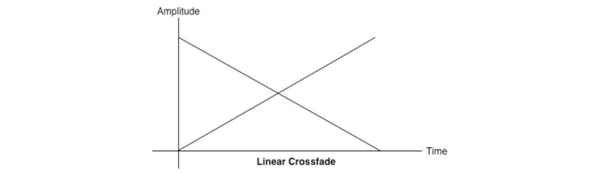
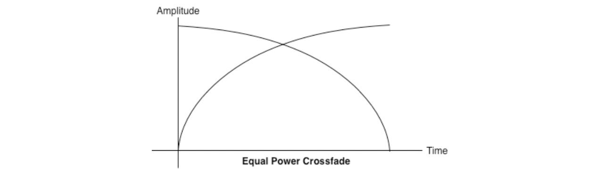
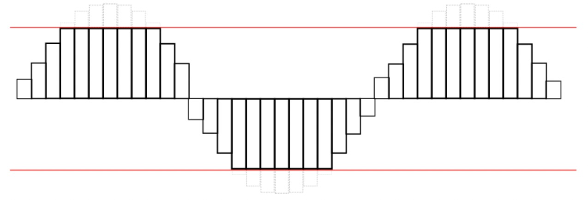
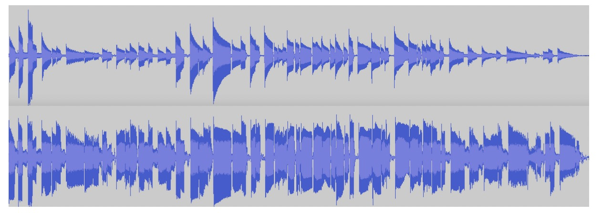
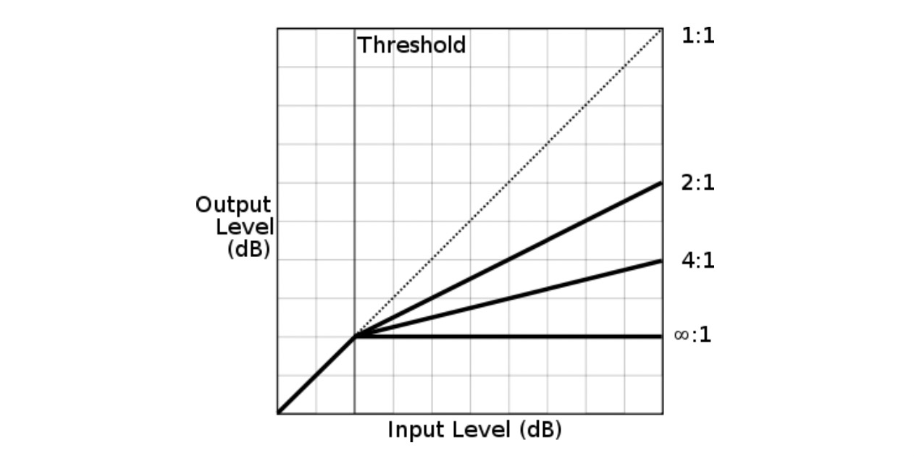

# Volume and Loudness

Once we are ready to play a sound, whether from an AudioBuffer or from other sources, one of the most basic parameters we can change is the loudness of the sound.
The main way to affect the loudness of a sound is using GainNodes. As previously mentioned, these nodes have a gain parameter, which acts as a multiplier on the incoming sound buffer. The default gain value is one, which means that the input sound is unaffected. Values between zero and one reduce the loudness, and values greater than one amplify（放大，扩大（声音）；增强，加强） the loudness. Negative gain (values less than zero) inverts the waveform (i.e., the amplitude is flipped).

# 音量和响度

> Loudness 响度 注：根据《韦氏词典》，响度是“一种声音的属性，它决定了所产生的听觉感觉的大小，主要取决于所涉及声波的振幅。”这意味着响度取决于你大脑中感知到的声音。而是声音对你来说有多大。这是主观的——例如，对你来说很响的声音对有听力问题的人来说可能听不到
>
> Volume 音量 注：我们通常用在收音机、电视、立体声或其他乐器上。你可以用控制按钮或滑块来控制响度。即使响度仍然是基于你的感知，乐器也可以以不同的水平播放音频

一旦我们准备与声音打交道，无论是 AudioBuffer 还是其它来源的声音，最基本的可控参数就是声音的响度

最主要可以影响音量响度的方式就是使用 GainNode。正如之前提到过的，音频节点都有一个 gain 参数，作为声音输入缓冲的乘数。默认值是 1，意为着没有任何影响。值从 0 至 1，如果值超过了 1 则放大了输入声音的响度。将 gain 值设为负值(值小于0) 则波形反转(幅度翻转了)。


## Volume, Gain, and Loudness

Let’s start with some definitions. Loudness is a subjective measure of how intensely our ears perceive a sound. Volume is a measure of the physical amplitude of a sound wave. Gain is a scale multiplier affecting a sound’s amplitude as it is being processed.
In other words, when undergoing a gain, the amplitude of a sound wave is scaled, with the gain value used as a multiplier. For example, while a gain value of one will not affect the sound wave at all, Figure 3-1 illustrates what happens to a sound wave if you send it through a gain factor of two.


Generally speaking, power in a wave is measured in decibels（分贝） (abbreviated 缩写;节略 dB), or one tenth of a Bel, named after Alexander Graham Bell. Decibels are a relative, logarithmic unit that compare the level being measured to some reference point. There are many different reference points for measuring dB, and each reference point is indicated with a suffix on the unit. Saying that a signal is some number of dB is meaningless without a reference point! For example, dBV, dBu, and dBm are all useful for measuring electrical signals. Since we are dealing with digital audio, we are mainly concerned with two measures: dBFS and dBSPL.

The first is dBFS, or decibels full scale. The highest possible level of sound produced by audio equipment is 0 dBFS. All other levels are expressed in negative numbers.
dBFS is described mathematically as:

The maximum dBFS value in a 16-bit audio system is:

Note that the maximum dBFS value will always be 0 by definition, since log(1) = 0.
Similarly, the minimum dBFS value in the same system is:

dBFS is a measure of gain, not volume. You can play a 0-dBFS signal through your stereo with the stereo gain set very low and hardly be able to hear anything. Conversely, you can play a −30-dBFS signal with the stereo gain maxed and blow your eardrums（耳膜） away.
That said, you’ve probably heard someone describe the volume of a sound in decibels. Technically speaking, they were referring to dBSPL, or decibels relative to sound pressure level. Here, the reference point is 0.000002 newtons per square meter (roughly the sound of a mosquito flying 3 m away). There is no upper value to dBSPL, but in practice, we want to stay below levels of ear damage (~120 dBSPL) and well below the threshold of pain (~150 dBSPL). The Web Audio API does not use dBSPL, since the final volume of the sound depends on the OS gain and the speaker gain, and only deals with dBFS.

The logarithmic definition of decibels correlates（相关） somewhat to the way our ears perceive loudness, but loudness is still a very subjective concept. Comparing the dB values of a sound and the same sound with a 2x gain, we can see that we’ve gained about 6 dB:

Every time we add 6 dB or so, we actually double the amplitude of the signal. Comparing the sound at a rock concert (~110 dBSPL) to your alarm clock (~80 dBSPL), the difference between the two is (110 − 80)/6 dB, or roughly 5 times louder, with a
gain multiplier of 2^5 = 32x. A volume knob（球形把手；旋钮） on a stereo is therefore also calibrated（校准；校准使...标准化） to increase the amplitude exponentially. In other words, turning the volume knob by 3
units multiplies the amplitude of the signal roughly by a factor of 2^3 or 8 times. In practice, the exponential model described here is merely an approximation to the way our ears perceive loudness, and audio equipment manufacturers often have their own custom gain curves that are neither linear nor exponential.


## 重要理论： 音量(Volume)，增益(Gain) 和响度(Loudness)

让我们从它们的定义开始。响度是我们耳朵理解声音的主观衡量。音量是从物理声波振幅来衡量。增益则是处理声波过程中对其波形振幅乘数缩放。

换句话来说，增益时一个声音波形的振幅乘以增益乘数后缩放了。举个例子，当值为 1 时不影响声音波形，图 3-1 图示了当声音波形通过增益值为2的节点后的结果


图 3-1  左侧是原波形，右侧是增益2后的波形

一般来说，波的功率以分贝(缩写为dB)或贝尔的十分之一来测量，贝尔以亚历山大·格雷厄姆·贝尔命名。分贝是相对的，将被测量的等级与某个参考点进行比较的对数单位。有多种不同的参考点用于测试分贝，每一种参考点都有着指示前缀单位。没有参考点说信号的分贝是无意义的！举个例子，dBV, dBu, 和 dBm 都是非常有用的衡量电信号方式。由于我们仅关心数字音频，我们主要关心两种测量方式： dBFS 和 dBSPL

第一种 dBFS (decibels full scale) .音频设备产生的最高声级是0 dBFS。所有其他级别都以负数表示.

dBFS 的数学描述如下：

```
dBFS = 20 * log( [sample level] / [max level] )
```

dBFS 最大值 在 16位音频系统中：

```
max = 20 * log(1111 1111 1111 1111/1111 1111 1111 1111) = log(1) = 0
```

注意，dBFS 由定义可得最大值总是为 0 

最小 dBFS 值在类似的系统中是：

```
min = 20 * log(0000 0000 0000 0001/1111 1111 1111 1111) = -96 dBFS
```

dBFS 是衡量增益而非音量。你可以试试 0-dBFS 将立体声节点增益设为最小值，这样应该几乎就听不到了。相反如果是 −30-dBFS 设为最大值，有可能会将你的耳膜吹破。

尽管如此，你还是很可能听到有人跟你分贝来描述用音量。从技术上讲，他们指的是dBSPL，即相对于声压级的分贝。这里，参考点是每平方米0.000002牛顿(大约是蚊子在3米外飞行的声音)。dBSPL 没有上限，但在实践中，我们希望保持在耳朵损伤水平(~120 dBSPL)以下，远低于疼痛阈值(~150 dBSPL)。Web Audio API 不使用 dBSPL，只使用 dBFS 这是因为最终音量取决于操作系统的增益和杨声器的增益。

分贝的对数定义在某种程度上与我们的耳朵感知声响的方式有关， 但声响依然是时分主观的概念。将一个声音的dB值与具有2倍增益的相同声音进行比较，我们可以看到我们获得了大约6 dB


```
diff = 20 * log(2/2^16) - 20 * log(1/2^16) = 6.02 dB
```


每次增加 6dB 左右，我们实际是对信号放大了双倍。对比摇滚音乐会(~110 dBSPL) 与你的闹钟(~80 dBSPL), 两者之差是 (110 − 80)/6 dB，或大概是5倍大小，即增益乘数2^5 = 32倍。立体音响的旋钮音量调节也是标准的指数增幅。也就是说音量旋钮转3个刻度单位意即音信号增大2的3次方也就是8倍。在此用指数模型描述仅仅是近似我们人耳认知的声响，而音响生产商一般都有自己的定制化增益曲线它即不是线性也不是指数形。


## Equal Power Crossfading
Often in a game setting, you have a situation where you want to crossfade between two environments that have different sounds associated with them. However, when to crossfade and by how much is not known in advance; perhaps it varies with the position of the game avatar, which is controlled by the player. In this case, we cannot do an automatic ramp.

In general, doing a straightforward, linear fade will result in the following graph. It can sound unbalanced because of a volume dip (下降) between the two samples, as shown in

To address this issue, we use an equal power curve, in which the corresponding gain curves are neither linear nor exponential, and intersect at a higher amplitude

(Figure 3-3). This helps avoid a dip in volume in the middle part of the crossfade, when both sounds are mixed together equally（相当地，同样地；平均地，相等地；）.

The graph in Figure 3-3 can be generated with a bit of math:

## 等功率交叉渐变(crossfade)

在游戏开发中，你会遇到一种情况，就是在两个拥有不同声音的环境中交叉渐变(crossfade), 然而什么时候渐变，渐变多少不是提前已知的; 很有可能是根据玩家的位置而变化的，这取决于玩家对角色的控制位置。所以在这种情况下，我们无法做到自动计算。

通常，直接进行线性渐变会得到以下图。它可能听起来不平衡，因为两个样本之间的音量下降，如图 3-2



图 3-2 两条音轨的线性交叉渐变

为了解决这种情况，我们使用等功率曲线，其中相应的增益曲线既不是线性的也不是指数的，并且在更高的振幅处相交图 3-3 。这有助于当两个声音均匀地混合在一起时避免在交叉渐变的中间部分音量下降。



图 3-3 等功率曲线线性交叉渐变要好的多

图 3-3 用一点点数学就能搞定：

```
function equalPowerCrossfade(percent) {
  // Use an equal-power crossfading curve:
  var gain1 = Math.cos(percent * 0.5*Math.PI);
  var gain2 = Math.cos((1.0 - percent) * 0.5*Math.PI); 
  this.ctl1.gainNode.gain.value = gain1; 
  this.ctl2.gainNode.gain.value = gain2;
}
```

## CRITICAL THEORY Clipping and Metering
Like images exceeding the boundaries of a canvas, sounds can also be clipped if the waveform exceeds its maximum level. The distinct distortion（歪曲，曲解；变形，失真） that this produces is obviously undesirable（不受欢迎的，不良的，不想要的）. Audio equipment often has indicators that show the magnitude（巨大，重要性；震级；规模，大小；数量，数值；（恒星的）亮度，星等） of audio levels to help engineers and listeners produce output that does not clip. These indicators are called meters (Figure 3-4) and often have a green zone (no clip‐ ping), yellow zone (close to clipping), and red zone (clipping).

Clipped sound looks bad on a monitor and sounds no better. It’s important to listen for harsh distortions, or conversely, overly subdued（克制，抑制（情绪）；镇压，制服） mixes that force your listeners to crank up the volume. If you’re in either of these situations, read on!


## 重要理论: 裁剪和计量

就像图片边界超过 canvas ，声音波形如果超出最大值限制也可以被裁剪。这种显著的失真肯定是不能接受的。为了不让工程师和用户知处理音频时不被裁剪，音箱设备通常会提供指示器显示音频数值等级。这些指示器被称为 meters (图 3-4)，它通常有一个绿色区域(不裁剪)，黄色区域（接近裁剪区），红色区（裁剪）。


图 3-4

被裁剪的声音看起来和听起来都不太好。重要的是要听刺耳的失真，或者相反，过度柔和的混音，迫使你的听众调大音量。如果你处于以上任何一种情况，请继续往下读


## Using Meters to Detect and Prevent Clipping
Since multiple sounds playing simultaneously （/ˌsaɪm(ə)lˈteɪniəsli/ 同时地）are additive（添加剂，添加物） with no level reduction（减小，降低；减价，折扣；）, you may find yourself in a situation where you are exceeding past the threshold of your speaker’s capability. The maximum level of sound is 0 dBFS, or 216, for 16-bit audio. In the floating point version of the signal, these bit values are mapped to [−1, 1]. The waveform of a sound that’s being clipped looks something like Figure 3-5. In the context of the Web Audio API, sounds clip if the values sent to the destination node lie outside of the range. It’s a good idea to leave some room (called headroom) in your final mix so that you aren’t too close to the clipping threshold.


In addition to close listening, you can check whether or not you are clipping your sound programmatically by putting a script processor node into your audio graph. Clipping may occur if any of the PCM values are out of the acceptable range. In this sample, we check both left and right channels for clipping, and if clipping is detected, save the last clipping time:

## 使用仪表检测与阻止裁剪

由于同时播放的多个声音是叠加的，这些声音音量没有降低级别，你可能会发现自己处于超出扬声器能力阈值的情况。16位的音频音量最高级 是 0 dBFS, 或 216。在信号的浮点数版本中，这些比特值都映射到了 [-1, 1]. 声音的波形被裁剪看起来像是图 3-5， 在 Web Audio API 上下文中，传递给目的节点（destination node）值如果超过了目的节点设备的范围则会发生裁剪。给最后混音留出一些空间(称为 headroom) 的做法就很好，这样你就不会太接近裁剪阈值了。



图 3-5 波形被裁剪的示意图


除了仔细聆听之外，您还可以通过将脚本处理器节点放入音频图中来检查是否以编程方式截取声音。如果任何PCM值超出可接受范围，可能会发生剪切。在这个示例中，我们检查左通道和右通道的剪辑，如果检测到剪辑，则保存最后的剪辑时间：

```
function onProcess(e) {
  var leftBuffer = e.inputBuffer.getChannelData(0); 
  var rightBuffer = e.inputBuffer.getChannelData(1); 
  checkClipping(leftBuffer); 
  checkClipping(rightBuffer);
}

function checkClipping(buffer) {
  var isClipping = false;
  // 检测循环迭代 buffer 是否超出值 1
  for (var i = 0; i < buffer.length; i++) {
    var absValue = Math.abs(buffer[i]); 
    if (absValue >= 1.0) {
      isClipping = true;
      break; 
    }
  }
  this.isClipping = isClipping; 
  if (isClipping) {
    lastClipTime = new Date(); 
  }
}
```


An alternative implementation of metering could poll a real-time analyzer in the audio graph for getFloatFrequencyData at render time, as determined by requestAnimationFrame (see Chapter 5). This approach is more efficient, but misses a lot of the signal (including places where it potentially clips), since rendering happens most at 60 times a second, whereas （但是，然而；鉴于） the audio signal changes far more quickly.

The way to prevent clipping is to reduce the overall level of the signal. If you are clipping, apply some fractional gain on a master audio gain node to subdue your mix to a level that prevents clipping. In general, you should tweak gains to anticipate（预期，预料；预见） the worst case, but getting this right is more of an art than a science. In practice, since the sounds playing in your game or interactive application may depend on a huge variety of factors that are decided at runtime, it can be difficult to pick the master gain value that prevents clipping in all cases. For this unpredictable case, look to dynamics compression, which is discussed in “Dynamics Compression” on page 28.


测量的另一种实现方式是在音频图内轮询一个实时解析器，在渲染时为 getFloatFrequencyData，它取决于 requestAnimationFrame 方法（见第5章）。这种方式更高效，但信号丢失的比较多(包含用于可能剪辑的空间位置)，由于渲染大多是每秒 60次，而音频信号相对变化的更快

阻止裁剪的方式是降低信号总电平。如果您正在进行剪辑，请在主音频增益节点上应用一些分数增益，以使您的混音降低到阻止裁剪。一般来说，你应该调整增益来预测最坏的情况, 但把它调的更好则是一种艺术而非科学的事儿了。由于游戏或交互式应用程序中播放的声音可能取决于运行时决定的各种因素，因此很难在所有情况下选择阻止裁剪的主增益节点值。对于这种不可预测的情况，请考虑动态压缩( Dynamics Compression )


## CRITICAL THEORY Understanding Dynamic Range

In audio, dynamic range refers to the difference between the loudest and quietest parts of a sound. The amount of dynamic range in musical pieces varies greatly depending on genre. Classical music has large dynamic range and often features very quiet sec‐ tions followed by relatively loud ones. Many popular genres like rock and electronica tend to have a small dynamic range, and are uniformly loud because of an apparent competition (known pejoratively as the “Loudness War”) to increase the loudness of tracks to meet consumer demands. This uniform loudness is generally achieved by using dynamic range compression.

That said, there are many legitimate uses of compression. Sometimes recorded music has such a large dynamic range that there are sections that sound so quiet or loud that the listener constantly needs to have a finger on the volume knob. Compression can quiet down the loud parts while making the quiet parts audible. Figure 3-6 illustrates a waveform (above), and then the same waveform with compression applied (below). You can see that the sound is louder overall, and there is less variance in the amplitude.




For games and interactive applications, you may not know beforehand what your sound output will look like. Because of games’ dynamic nature, you may have very quiet periods (e.g., stealthy sneaking) followed by very loud ones (e.g., a warzone). A compressor node can be helpful in suddenly loud situations for reducing the likeli‐ hood of clipping [see “Clipping and Metering” on page 24].

Compressors can be modeled with a compression curve with several parameters, all of which can be tweaked with the Web Audio API. Two of the main parameters of a compressor are threshold and ratio. Threshold refers to the lowest volume at which a compressor starts reducing dynamic range. Ratio determines how much gain reduction is applied by the compressor. Figure 3-7 illustrates the effect of threshold and various compression ratios on the compression curve.




