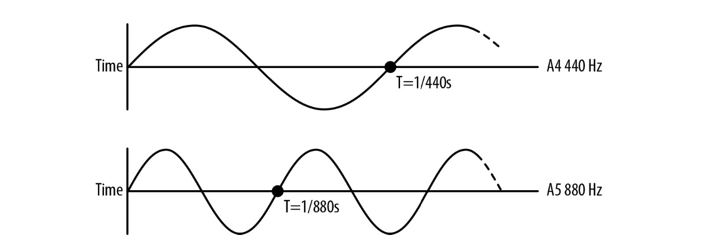

# chapter 4 Pitch and the Frequency Domain

So far we have learned about some basic properties of sound: timing and volume. To do more complex things, such as sound equalization (e.g., increasing the bass and decreasing the treble), we need more complex tools. This section explains some of the tools that allow you to do these more interesting transformations, which include the ability to simulate different sorts of environments and manipulate sounds directly with JavaScript.

# 音调与频域

到目前为止我们已经学过了声音的基础属性：定时与音量。为了能处理更复杂的的情况，例如声音的均衡(比如，增加低音和降低高音)，我们需要更复杂的工具。此章节将介绍一些用于更有趣的转换工具，这些工具能模拟不同的声音环境并且可以直接使用 JavaScript 操作。


## CRITICAL THEORY Basics of Musical Pitch

Music consists（由……构成；由……组成） of many sounds played simultaneously（同时地）. Sounds produced by musical instruments can be very complex, as the sound bounces through various parts of the instrument and is shaped in unique ways. However, these musical tones all have one thing in common: physically, they are periodic waveforms. This periodicity （[数] 周期性；频率；定期性） is perceived by our ears as pitch. The pitch of a note is measured in frequency, or the number of times the wave pattern repeats every second, specified in hertz. The frequency is the time (in seconds) between the crests (峰,嵴,更强调山峰，山脊轮廓) of the wave. As illustrated in Figure 4-1, if we halve the wave in the time dimension, we end up with（最张得到） a correspondingly doubled frequency, which sounds to our ears like the same tone, one octave （八度音阶） higher. Conversely, if we extend the wave’s frequency by two, this brings the tone an octave down. Thus, pitch (like volume) is perceived exponentially by our ears: at every octave, the frequency doubles.

## 重要理论：音调基础

音乐是由多种声音同时播放所构成的。由乐器产生的声音可以非常的复杂，因为声音通过乐器的各个部分反射，并以独特的方式形成。然而这些音调都有共同的特征：从物理上讲，它们都是周期性的波形。这些周期波形在我们耳朵听来就是音调。衡量音的音调由频率决定，每秒重复波形的次数被叫作赫兹。频率是波峰之间的时间差(单位为秒)。如图 4-1 所示，如果我们时间维度减半，我们最终得到的是相应加倍的频率，同样的音色，高一个八度。与之相反，如果我们将频率延展两倍，这会使音色降低一个八度。所以，我们的耳朵感知到的音调（就像音量）是指数级地：每一个八度，频率翻一倍。

> 注：八度音，是指两个音之间的音高距离，其中一个音的频率是另一个音的两倍
> 
> 注： 国际标准音高 A4 为 440 赫兹， 比 A4 高一个八度的 A5 即为 880 赫兹，比 A4 低一个八度的 A3 则为 220 赫兹
>




图 4-1

Octaves are split up into 12 semitones. Each adjacent （adj.邻近的，毗连的；） semitone pair has an identical frequency ratio (at least in equal-tempered（temper 坏脾气，暴躁脾气；心情，情绪；怒气，火气；<正式>（时代的）气息，特征；（人或动物的）性格，性情；（钢等的）硬度，回火性；沉着，冷静） tunings 调音；起音，定音；音调). In other words, the ratios of the frequencies of A4 to A#4 are identical to A#4 to B.

Figure 4-1 shows how we would derive the ratio between every successive(adj.连续的，依次的；接替的，继承的) semitone, given that:

1. To transpose a note up an octave, we double the frequency of the note.
2. Each octave is split up into 12 semitones, which, in an equal tempered tuning, have identical frequency ratios.

Let’s define a f 0 to be some frequency, and f 1 to be that same note one octave higher. we know that this is the relationship between them:

Next, let k be the fixed multiplier between any two adjacent semitones. Since there are
12 semitones in an octave, we also know the following:

Solving the system of equations above, we have the following:


Solving for k:

Conveniently, all of this semitone-related offsetting isn’t really necessary to do manually, since many audio environments (the Web Audio API included) include a notion（概念） of detune, which linearizes the frequency domain. Detune is measured in cents, with each octave consisting of 1200 cents, and each semitone consisting of 100 cents. By specifying（指定） a detune of 1200, you move up an octave. Specifying a detune of −1200 moves you down an octave.


八度音分成12个半音。每个相邻的半音对具有相同的频率比（至少在同等程度上的音调是这样）, 换句话说， A4 到 A#4 的比率 与 A#4 到 B 是相等的。

> A#4 在音乐中表示一个音符， A# 指 A 音升高半音的表示方法，4 指的是音高的位置

展示了我们如何推导每个连续半音之间的比例。得到的结论：

1. 为了把一个音符向上转一个八度，我们把这个音符的频率加倍
2. 每个八度音分成12个半音，同等程度的音调拥有相等的频率比

让我们定义 f0 表示某个频率， f1 表示高八度的同音。我们知道它们之间的关系：

f1 = 2 * f0

接下来，设 k 作为 两个连续半音间的乘数。由于八度音阶有12个半音，可得：

f1 = f0 * k *  k * k * ... * k(12x) = f0 * k^12

解上面的方程组，得：

2 * f0 = f0 * k^12

解得 k：

k = 2^(1/12) = 1.0595...


其实没那么麻烦，所有这些与半音相关的偏移实际上都不需要手动执行，因为很多音频环境(包括 Web Audio API)包含了失谐(detune)的概念，它使频域线性化。Detune 的单位是分，每个八度包含 1200 分, 每个半音包含了 100 分。通过指定1200的调谐，你提高了一个八度，指定 -1200 则降低一个八度。


## Pitch and playbackRate
The Web Audio API provides a playbackRate parameter on each AudioSourceNode. This value can be set to affect the pitch of any sound buffer. Note that the pitch as well as the duration of the sample will be affected in this case. There are sophisticated methods that try to affect pitch independent of duration, but this is quite difficult to do in a general-purpose way without introducing blips, scratches, and other undesirable artifacts to the mix.

As discussed in “Basics of Musical Pitch” on page 29, to compute the frequencies of successive semitones, we simply multiply the frequency by the semitone ratio 21/12. This is very useful if you are developing a musical instrument or using pitch for randomization in a game setting. The following code plays a tone at a given frequency offset in semitones:

## 音调(Pitch) 与 playbackRate

Web Audio API 在每个 AudioSourceNode 上提供了一个 playbackRate 参数。这个参数值可以影响任何声音缓冲。注意，在这种情况下，音高和样本的时长都会受到影响。有一些复杂的方法试图影响音高而影响音频的时长，但是要以通用的方式做到这一点是非常困难的，否则就会在混合中引入奇奇怪怪的东西。


在“重要理论：音调基础”一节中讨论过, 我们简单的通过半音比率 2^(1/12) 乘以频率计算出连续的半音频率. 如果你正在开发一种乐器或在游戏设置中使用随机音调，这将非常有用。下面的代码演示了
在半音中以给定的频率偏移播放音调

```
function playNote(semitones) {
  // 假定新的 source 从 buffer 中创建了.
  var semitoneRatio = Math.pow(2, 1/12); 
  source.playbackRate.value = Math.pow(semitoneRatio, semitones); 
  source.start(0);
}
```


As we discussed earlier, our ears perceive pitch exponentially. Treating pitch as an exponential quantity can be inconvenient, since we often deal with awkward values such as the twelfth root of two. Instead of doing that, we can use the detune parameter to specify our offset in cents. Thus you can rewrite the above function using detune in an easier way:

正如我们之前讨论过的那样，我们的耳朵是以指数级感知音调的。将音调当作指数量对待是不方便的，这样的话我们会经常和一些怪怪的值打交道比如 2 的 12 次方根。取而代之的是我们可以使用失谐参数(detune) 指定要偏移多少分。 所以你可以以更简单的方式重写上面的失谐函数了：

```
function playNote(semitones) {
  source.detune.value = semitones * 100; 
  source.start(0);
}
```


If you pitch shift by too many semitones (e.g., by calling playNote(24);), you will start to hear distortions([物]畸变，[力]扭曲，失真). Because of this, digital pianos include multiple samples for each instrument. Good digital pianos avoid pitch bending at all, and include a separate sample recorded specifically for each key. Great digital pianos often include multiple samples for each key, which are played back depending on the velocity of the key press.


如果你的音调转了太多的半音(比如，playNote(24)), 你会开始听到失真。正因如此，数字钢琴为每个乐器包括多个样本。好的数字钢琴完全避免音高弯曲，并包括为每个键专门录制的单独样本。
优秀的数字钢琴通常为每个键包含多个样本，这些样本会根据按键的速度回放


## Multiple Sounds with Variations
A key feature of sound effects in games is that there can be many of them simultane‐ ously. Imagine you’re in the middle of a gunfight with multiple actors shooting machine guns. Each machine gun fires many times per second, causing tens of sound effects to be played at the same time. Playing back sound from multiple, precisely- timed sources simultaneously is one place the Web Audio API really shines.
Now, if all of the machine guns in your game sounded exactly the same, that would be pretty boring. Of course the sound would vary based on distance from the target and relative position [more on this later in “Spatialized Sound” on page 49], but even that might not be enough. Luckily the Web Audio API provides a way to easily tweak the previous example in at least two simple ways:


