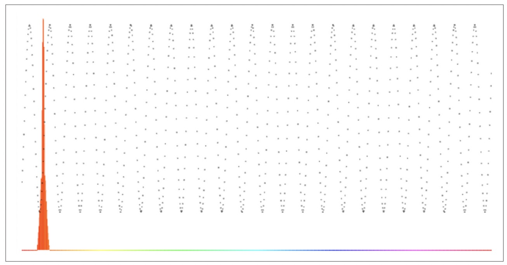
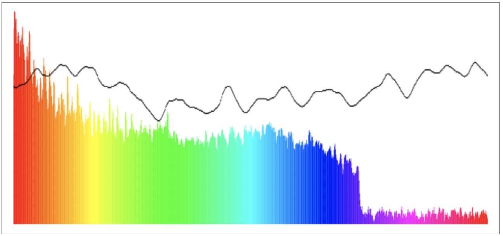

# CHAPTER 5 Analysis and Visualization
So far we’ve only talked about audio synthesis and processing, but that is only half of the functionality that the Web Audio API provides. The other half, audio analysis, is all about understanding what the sound that is being played is like. The canonical(根据教规的，按照宗教法规的；真经的，正经的；标准的，典范的；准确的，权威的；公认的，依据科学法则的；（数学表达式）最简洁的；（与）公理（或标准公式）（有关）的；（与）教会（或教士）（有关）的
) example of this feature is visualization, but there are many other applications far outside the scope of this book, including pitch detection, rhythm（节奏，韵律，节拍） detection, and speech recognition.

This is an important topic for us as game developers and interactive application builders for a couple of reasons. Firstly, a good visual analyzer can act as a sort of debugging tool (obviously in addition to your ears and a good metering setup) for tweaking sounds to be just right. Secondly, visualization is critical for any games and applications related to music, from games like Guitar Hero to software like GarageBand.


# 分析与可视化

到目前为止，我们仅讨论了音频的合成与处理，但这仅是 Web Audio API 提供的一半功能。另一半功能则是音频的分析，它播放起来应该是什么样子的。它最经典的例子就是音频可视化，但其实有更多的其它应用场景，包括单调侦测，节减侦测，语音识别等，这已大大超出本书范围。

对于游戏或交互式应用开发者来说，这是一个重要的主题，原因有几点。首先，一个好的可视化分析器可以用于类似调式工具（显然这是除了你耳朵之外，良好的计量工具）用于调音。其次，对于某些关于音乐相关的游戏或应用来说可视化是重点比如游戏“吉它英雄”或者应用软件 GarageBand (苹果电脑上吉它教学软件)


## Frequency Analysis
The main way of doing sound analysis with the Web Audio API is to use AnalyserNodes. These nodes do not change the sound in any way, and can be placed anywhere in your audio context. Once this node is in your graph, it provides two main ways for you to inspect the sound wave: over the time domain and over the frequency domain.

The results you get are based on FFT analysis over a certain buffer size. We have a few knobs（球形把手；旋钮） to customize the output of the node:

fftSize
This defines the buffer size that is used to perform the analysis. It must be a power of two. Higher values will result in more fine-grained analysis of the signal, at the cost of some performance loss.

frequencyBinCount
This is a read-only property, set automatically as fftSize/2.

smoothingTimeConstant
This is a value between zero and one. A value of one causes a large moving average window and smoothed results. A value of zero means no moving average, and quickly fluctuating results.


The basic setup is to insert the analyzer node into the interesting part of our audio graph:

then we can get frequency or time domain arrays as follows:


## 频率分析

在 Web Audio API 分析声音是最主要的方式利用 AnalyserNodes。这些节点不会对声音本身做任何改变，可以在音频上下文任何处调用。一旦在音频图中创建了这样的节点，它就会提供两种主要方式用于查看声音波形：在时域和在频域上

得到的结果是基于特定缓冲区大小的 FFT 分析。我们有一些定制化节点输出的属性可用：

- fftSize
  定义缓冲区大小用于实现分析。大小一定是2的幂。较高的值将导致对信号进行更细粒度的分析，但代价是一些性能损失。

- frequencyBinCount
  这个属性是只读的，自动为 fftSize / 2。

- smoothingTimeConstant
  值范围是 0 - 1. 值为1会导致较大的移动平均窗口和平滑结果。值为零意味着没有移动平均线，结果波动很快。


最基本的设置就是把分析节点插到我们感兴趣的音频图谱中：

```
// 假设节点A与B普普通通相连
var analyser = context.createAnalyser(); 
A.connect(analyser); 
analyser.connect(B);
```

然后我们就可以得到时域或频域了：

```
var freqDomain = new Float32Array(analyser.frequencyBinCount); 
analyser.getFloatFrequencyData(freqDomain);
```


In the previous example, freqDomain is an array of 32-bit floats corresponding to the frequency domain. These values are normalized to be between zero and one. The indexes of the output can be mapped linearly between zero and the "nyquist frequency", which is defined to be half of the sampling rate (available in the Web Audio API via context.sampleRate). The following snippet maps from frequency to the correct bucket in the array of frequencies:

在上面的代码例子中，freqDomain 是一个频域 32 位浮点数组。这些数组内存的值都被标准化为 0-1。输出的指标可以在0和奈奎斯特频率之间线性映射，奈奎斯特频率被定义为采样率的一半(在 Web Audio API 中通过 context.sampleRate 获取)。下面的代码片段将 frequency 映射到频率数组中的正确位置：

> 奈奎斯特频率是离散信号系统采样频率的一半也就是1/2fs，fs为采样频率

```
function getFrequencyValue(frequency) {
  var nyquist = context.sampleRate/2;
  var index = Math.round(frequency/nyquist * freqDomain.length); 
  return freqDomain[index];
}
```
<!-- 如何理解 Nyquist 采样定理？ - 甜草莓的回答 - 知乎
https://www.zhihu.com/question/24490634/answer/490847222 -->

If we are analyzing a 1,000-Hz sine wave, for example, we would expect that getFrequencyValue(1000) would return a peak value in the graph, as shown in Figure 5-1.

The frequency domain is also available in 8-bit unsigned units via the getByteFrequencyData call. The values of these integers is scaled to fit between minDecibels( decibel 分贝) and maxDecibels (in dBFS) properties on the analyzer node, so these parameters can be tweaked to scale the output as desired.

如果我们分析的是一个 1000 Hz 的正弦波，举例，我们期望调用 `getFrequencyValue(1000)` 时返回图像内的峰值，如图 5-1。

频域通过调用 getByteFrequencyData 使用8位无符号存储也可以。 这些值就是无符号整型，在分析节点( analyzer node)它会缩放以适配在最大分贝和最小分贝之间（即在 dBFS中，decibels full scale）。因此可以根据需要调整这些参数以缩放输出。



图 5-1，一个 1000Hz 的可视化声音(全频域是从 0 至 22050Hz)


## Animating with requestAnimationFrame
If we want to build a visualization for our soundform, we need to periodically query the analyzer, process the results, and render them. We can do this by setting up a JavaScript timer like setInterval or setTimeout, but there’s a better way: requestAnimationFrame. This API lets the browser incorporate your custom draw function into its native rendering loop, which is a great performance improvement. Instead of forcing it to draw at specific intervals and contending with （contend with  与...作斗争） the rest of the things a browser does, you just request it to be placed in the queue, and the browser will get to it as quickly as it can.
Because the requestAnimationFrame API is still experimental, we need to use the prefixed version depending on user agent, and fall back to a rough equivalent: setTi meout. The code for this is as follows:


Once we have this requestAnimationFrame function defined, we should use it to query the analyzer node to give us detailed information about the state of the audio stream.


## requestAnimationFrame 实现动画

如果我们想要对我们的声音进行可视化，我们需要周期性的查询分析节点(analyzer node), 处理返回的结果，并渲染出来。我们可以利用 JavaScript 的定时器实现，setInterval, setTimeout, 但现在有更好用的：requestAnimationFrame。该 API 允许浏览器将你的自定义绘制函数合并到浏览器本地渲染循环中，这对性能来讲会有很大提升。不同于指定固定绘制间隔需要等待浏览器空闲时才来处理你的定时器不同，你只需要将它提交到队列中，浏览器会以最快的速度执行它。

由于 requestAnimationFrame 还是处于实验性质，你需要为其指定浏览器前缀，且给它定一个相似功能的 setTimeout 来兜底。代码如下：

```
window.requestAnimationFrame = (function(){ return window.requestAnimationFrame || window.webkitRequestAnimationFrame || window.mozRequestAnimationFrame || window.oRequestAnimationFrame || window.msRequestAnimationFrame ||
function(callback){
      window.setTimeout(callback, 1000 / 60);
    };
})();
```

一但定义好了 requestAnimationFrame 函数，我们需要利用它来查询分析节点得到音频流的详细信息。


## Visualizing Sound
Putting it all together, we can set up a render loop that queries and renders the analyzer for its current frequency analysis as before, into a freqDomain array:

We can do a similar thing for the time-domain data as well:


## 声音可视化

把它们全组合在一起，设置一个渲染循环用于查询和渲染之前用到的分析节点，将存进 freqDomain 数组：

```
var freqDomain = new Uint8Array(analyser.frequencyBinCount); 
analyser.getByteFrequencyData(freqDomain);
for (var i = 0; i < analyser.frequencyBinCount; i++) {
  var value = freqDomain[i];
  var percent = value / 256;
  var height = HEIGHT * percent;
  var offset = HEIGHT - height - 1;
  var barWidth = WIDTH/analyser.frequencyBinCount;
  var hue = i/analyser.frequencyBinCount * 360; 
  drawContext.fillStyle = 'hsl(' + hue + ', 100%, 50%)'; 
  drawContext.fillRect(i * barWidth, offset, barWidth, height);
}
```

对时域也可以进行类似的操作

```
var timeDomain = new Uint8Array(analyser.frequencyBinCount); 
analyser.getByteTimeDomainData(freqDomain);
for (var i = 0; i < analyser.frequencyBinCount; i++) {
  var value = timeDomain[i];
  var percent = value / 256;
  var height = HEIGHT * percent;
  var offset = HEIGHT - height - 1;
  var barWidth = WIDTH/analyser.frequencyBinCount; 
  drawContext.fillStyle = 'black'; 
  drawContext.fillRect(i * barWidth, offset, 1, 1);
}
```

This code plots time-domain values using HTML5 canvas, creating a simple visualizer that renders a graph of the waveform on top of the colorful bar graph, which represents frequency-domain data. The result is a canvas output that looks like Figure 5-2, and changes with time.

此代码将时域内的值利用 HTML5 canvas 绘制，创建一个简单的可视化图形，在代表频域数据的彩色色条状图的顶部绘制了一个波形线条。结果在 canvas 上绘制出来应该如图 5-2



图 5-2 某一时刻的可视化截图

Our approach to visualization misses a lot of data. For music visualization purposes, that’s fine. If, however, we want to perform a comprehensive analysis of the whole audio buffer, we should look to other methods.

我们处理可视化方法遗漏了很多数据。但对音乐的可视化来说足够了。当然如果我们想综合全面分析整个音频缓冲区，我们需要看看其它的方法。


