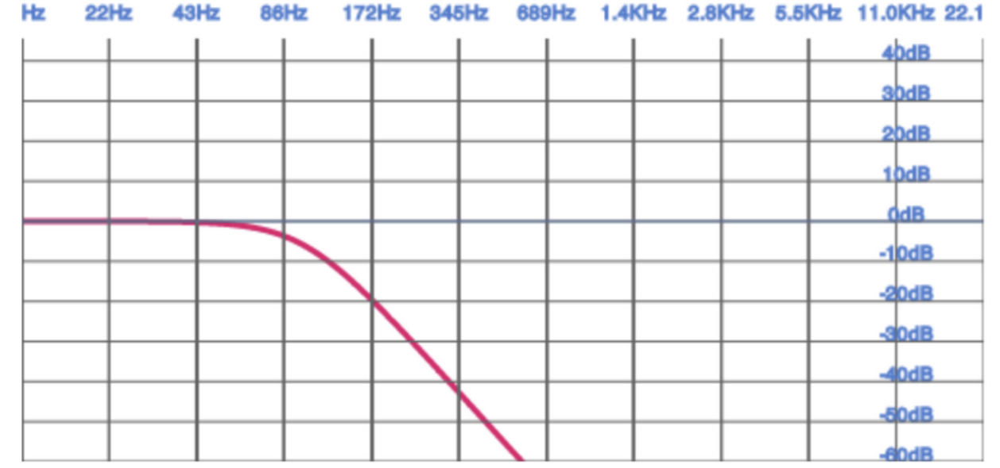

# CHAPTER 6 Advanced Topics
This chapter covers topics that are very important, but slightly more complex than the rest of the book. We will dive into adding effects to sounds, generating synthetic sound effects without any audio buffers at all, simulating effects of different acoustic（/əˈkuːstɪk/声音的，听觉的；） environments, and spatializing sound in 3D space.

# 高级主题

这一章涵盖了非常重要的主题，但比本书的其他部分稍微复杂一些。 我们会深入对声音添加音效，完全不通过任何音频缓冲来计算合成音效, 模拟不同声音环境的效果，还有关于空 3D 空间音频。


## CRITICAL THEORY Biquad Filters

A filter can emphasize or de-emphasize certain parts of the frequency spectrum(范围，幅度；光谱；波谱，频谱；余象) of a sound. Visually, it can be shown as a graph over the frequency domain called a frequency response graph (see Figure 6-1). For each frequency, the higher the value of the graph, the more emphasis is placed on that part of the frequency range. A graph sloping downward places more emphasis on low frequencies and less on high frequencies.
Web Audio filters can be configured with three parameters: gain, frequency, and a quality factor (also known as Q). These parameters all affect the frequency response graph differently.
There are many kinds of filters that can be used to achieve certain kinds of effects:


Low-pass filter
  Makes sounds more muffled
High-pass filter
  Makes sounds more tinny
Band-pass filter
  Cuts off lows and highs (e.g., telephone filter)
Low-shelf filter
  Affects the amount of bass in a sound (like the bass knob on a stereo)
High-shelf filter
  Affects the amount of treble in a sound (like the treble knob on a stereo)
Peaking filter
  Affects the amount of midrange in a sound (like the mid knob on a stereo)
Notch filter
  Removes unwanted sounds in a narrow frequency range
All-pass filter
  Creates phaser effects

All of these biquad（双四边形） filters stem from a common mathematical model and can all be graphed like the low-pass filter in Figure 6-1. More details about these filters can be found in more mathematically demanding books such as Real Sound Synthesis for Interactive Applications by Perry R. Cook (A K Peters, 2002), which I highly recommend reading if you are interested in audio fundamentals.

## 重要理论：双二阶滤波器

一个滤波可以增强或减弱声音频谱的某些部分。 直观地，在频域上它可以被表示为一个图表被称为“频率响应图”（见图 6-1）。在每一个频率上，对于每一个频率，图形的值越高，表示频率范围的那一部分越受重视。向下倾斜的图表更多地强调低频，而较少强调高频。

Web Audio 滤镜可配置3个参数： gain, frequency 和 质量因子( 常称为 Q)。这些参数全部会不同程度影响频率响应图。

有很多种滤镜可以用来达到特定的效果:

- Low-pass 滤波
  使声音更低沉

- High-pass 滤波器
  使声音更微小

- Band-pass 滤波器
  截掉低点和高点(例如，电话滤波器)  

- Low-shelf 滤波器
  影响声音中的低音量(如立体声上的低音旋钮)  

- Peaking  滤波器
  影响声音中音的数量(如立体声上的中音旋钮)

- Notch 滤波器
  去除窄频率范围内不需要的声音

- All-pass 滤波器
  创建相位效果




图 6-1 低通滤波器的频率响应图


所有这些双二元滤波器(biquad filter)都源于一个共同的数学模型，并且都可以用图形表示, 就像低通滤波器(low-pass filter) 一样(图 6-1)。 关于更多的滤波器细节参考对数学要求更高的这本书《Real Sound Synthesis for Interactive》作者 Perry R. Cook。 如果你对音频底层原理感兴趣的话我强烈推荐你阅读它。


## Adding Effects via Filters
Using the Web Audio API, we can apply the filters discussed above using BiquadFilterNodes. This type of audio node is very commonly used to build equalizers and manipulate sounds in interesting ways. Let’s set up a simple low-pass filter to eliminate (
剔除) low frequency noise from a sound sample:

## 通过滤波器添加效果
要使用 Web Audio API ，我们可以通过应用上面提到过的 BiquadFilterNodes。

这个类型的音频节点，在创建均衡器并以有趣的方式操纵声音时应用非常普遍。让我们设置一个简单的低通滤波器(low-pass filter) 在一个声音例子中用它过滤掉低频噪声：

```
// Create a filter
var filter = context.createBiquadFilter();
// Note: the Web Audio spec is moving from constants to strings. // filter.type = 'lowpass';
filter.type = filter.LOWPASS;
filter.frequency.value = 100;
// Connect the source to it, and the filter to the destination.
```

The BiquadFilterNode has support for all of the commonly used second-order filter types. We can configure these nodes with the same parameters as discussed in the previous section, and also visualize the frequency response graphs by using the get FrequencyResponse method on the node. Given an array of frequencies, this function returns an array of magnitudes of responses corresponding to each frequency.

Chris Wilson and Chris Rogers put together a great visualizer sample (Figure 6-2) that shows the frequency responses of all of the filter types available in the Web Audio API.

BiquadFilterNode 支持所有常用的二阶过滤器类型。我们可以使用与前一节中讨论的相同的参数配置这些节点，并且还可以通过在节点上使用get FrequencyResponse方法来可视化频率响应图。给定一个频率数组，该函数返回对应于每个频率的响应幅度数组。

Chris Wilson 和 Chris Rogers 非常好的可视化例子，将所有 Web Audio API 可用的滤波器类型放到一起的频率反应图。


图 6-2 带参数的低通滤波器的频率响应图


## Procedurally Generated Sound
Up to now, we have been assuming that your game’s sound sources are static. An audio designer creates a bunch of assets and hands them over to you. Then, you play them back with some parameterization depending on local conditions (for example, the room ambiance 
氛围，周围环境，格调；背景音 and relative positions of sources and listeners). This approach has a few disadvantages:

1. Sound assets will be very large. This is especially bad on the Web, where instead of loading from a hard drive, you load from a network (at least the first time), which is roughly an order of magnitude slower.

2. Even with many assets and tweaks to each, there is limited variety.

3. You need to find assets by scouring(搜查；擦亮；擦洗) sound effects libraries, and then maybe worry about royalties ( royalty 版权\版税 ). Plus, chances are, any given sound effect is already being used in other applications, so your users have unintended associations.

We can use the Web Audio API to fully generate sound procedurally. For example, let’s simulate a gun firing. We begin with a buffer of white noise, which we can generate with a ScriptProcessorNode as follows:

## 程序化生成声音

到目前为止，我们假定你游戏中用到的都是静态的声音。音频设计师自己创建并处理了一堆音频资源，你负责根据当前条件使用一些参数控制播放这些音频（举例，房间内的背景音和音频资源位置与听众）。这种实现方式不够先进：

1. 声音文件可能会非常大。在网页中尤其不好，与在本地磁盘加载不同，通常是通过网络加载的(特别是第一次加载时)，  简直慢了一个数量级。

2. 就算拥有多众多资源和变和简单的变形，变化种类还是有限。

3. 你需要通过搜索音效库来找到资产，然后可能还要担心版权问题.另外，很有可能，任何给定的声音效果已经在其他应用 程序中使用过，所以您的用户会产生意想不到的关联

我们完全可以利用程序使用 Web Audio API 来直接生成声音。举个例子，让我们来模拟一下枪开火的声音。我们从一个白器噪声的冲级区开始，它使用 ScriptProcessorNode 生成如下：

```
function WhiteNoiseScript() {
  this.node = context.createScriptProcessor(1024, 1, 2); 
  this.node.onaudioprocess = this.process;
}
WhiteNoiseScript.prototype.process = function(e) { 
  var L = e.outputBuffer.getChannelData(0);
  var R = e.outputBuffer.getChannelData(1);
  for (var i = 0; i < L.length; i++) {
    L[i] = ((Math.random() * 2) - 1);
    R[i] = L[i]; 
  }
};
```

This code is not an efficient implementation because JavaScript is required to constantly and dynamically create a stream of white noise. To increase efficiency, we can programmatically generate a mono AudioBuffer of white noise as follows:

上面的代码实现不够高效，因为 JavaScript 需要不断动态地创建白噪音流，为了增强效率， 我们可以以程序化的方式生成白噪声的单声道音频缓冲，如下所示：

```
function WhiteNoiseGenerated(callback) {
  // Generate a 5 second white noise buffer.
  var lengthInSamples = 5 * context.sampleRate;
  var buffer = context.createBuffer(1, lengthInSamples, context.sampleRate); 
  var data = buffer.getChannelData(0);
  for (var i = 0; i < lengthInSamples; i++) { 
    data[i] = ((Math.random() * 2) - 1);
  }
  // Create a source node from the buffer.
  this.node = context.createBufferSource(); 
  this.node.buffer = buffer;
  this.node.loop = true; 
  this.node.start(0);
}
```


Next, we can simulate various phases of the gun firing—attack, decay, and release—in an envelope:

接下来，我们可以在一个封装好的函数中模拟枪射击的各个阶段——攻击、衰减和释放：

```
function Envelope() {
  this.node = context.createGain() 
  this.node.gain.value = 0;
}
Envelope.prototype.addEventToQueue = function() {
  this.node.gain.linearRampToValueAtTime(0, context.currentTime);
  this.node.gain.linearRampToValueAtTime(1, context.currentTime + 0.001); 
  this.node.gain.linearRampToValueAtTime(0.3, context.currentTime + 0.101); 
  this.node.gain.linearRampToValueAtTime(0, context.currentTime + 0.500);
}
```

Finally, we can connect the voice outputs to a filter to allow a simulation of distance:

最后，我们可以将声音输出连接到一个滤波器，以模拟距离

```
this.voices = []; 
this.voiceIndex = 0;
var noise = new WhiteNoise();
var filter = context.createBiquadFilter();
filter.type = 0;
filter.Q.value = 1;
filter.frequency.value = 800;
// Initialize multiple voices.
for (var i = 0; i < VOICE_COUNT; i++) { 
  var voice = new Envelope(); 
  noise.connect(voice.node); 
  voice.connect(filter); 
  this.voices.push(voice);
}
var gainMaster = context.createGainNode(); 
gainMaster.gain.value = 5; 
filter.connect(gainMaster);
gainMaster.connect(context.destination);
```

This example is borrowed from BBC’s gunfire effects page with small modifications,
including a port to JavaScript.
As you can see, this approach is very powerful but gets complicated pretty quickly, going beyond the scope of this book. For more information about procedural sound generation, take a look at Andy Farnell’s Practical Synthetic Sound Design tutorials and book.

这个例子移值修改自 BBC 的开枪音效(http://webaudio.prototyping.bbc.co.uk/gunfire/) 适配 JavaScript.

正如您所看到的，这种方法非常强大，但很快就会变得复杂，超出了本书的范围. 更多关于声音的处理与生成可参考 Andy Farnell 的《Practical Synthetic Sound Design tutorials》


## Room Effects
Before sound gets from its source to our ears, it bounces off walls, buildings, furniture 家具, carpets, and other objects. Every such collision changes properties of the sound. For example, clapping your hands outside sounds very different from clapping your hands inside a large cathedral(大教堂), which can cause audible reverberations(多重回音) for several seconds. Games with high production value aim to imitate(v.
模仿，仿效；作滑稽模仿；仿造，伪造) these effects. Creating a separate set of samples for each acoustic (
声音的，听觉的)environment is often prohibitively expensive, since it requires a lot of effort from the audio designer, and a lot of assets, and thus a larger amount of game data.

The Web Audio API comes with a facility to simulate these various acoustic environments called a ConvolverNode. Examples of effects that you can get out of the convolution engine include chorus(v.n. 合唱) effects, reverberation(n.混响,回声), and telephone-like speech.

The idea for producing room effects is to play back a reference sound in a room, record it, and then (metaphorically adv.
隐喻地；用比喻) take the difference between the original sound and the recorded one. The result of this is an impulse response that captures the effect that the room has on a sound. These impulse responses are painstakingly(adv.
煞费苦心地；费力地) recorded in very specific studio settings, and doing this on your own requires serious dedication(n.
献身，奉献；献辞；落成典). Luckily, there are sites that host many of these pre-recorded impulse response files (stored as audio files) for your convenience.

The Web Audio API provides an easy way to apply these impulse responses to your sounds using the ConvolverNode. This node takes an impulse response buffer, which is a regular AudioBuffer with the impulse response file loaded into it. The convolver is effectively a very complex filter (like the BiquadFilterNode), but rather than selecting from a set of effect types, it can be configured with an arbitrary filter response


## 房间音效

在声音从源头到我们耳朵之前， 它会在墙，建筑物，家具, 地毯还有其它物体间反复碰撞。 每一次碰撞都会改变一些声音的属性。例如，你在室外拍手和你在大教堂内拍手的声音会有很大的不同， 在大教堂内声音会有多数秒钟的多重回音。高质量的游戏旨在模仿这些效果。为每个声音环境创建单独的样本集通常是非常昂贵的，因为这需要音频设计师付出大量的努力，以及大量的音频资源，会造成游戏资源数据也会非常大。

Web Audio API 提供了一个叫 ConvolverNode 音频节点用于模拟各种声音环境。您可以从卷积引擎中获得的效果示例包括合唱效果、混响和类似电话的语音。制作房间效果的想法是在房间里引用播放一个声音，记录下来, 然后(打个比方)取原始声音和录制声音之间的差异。 这样做的结果是一个脉冲响应，它捕捉到房间对声音的影响.这些脉冲响应是在非常特殊的工作室环境中精心记录的，你自己做这件事需要认真的投入.幸运的是，有些网站托管了许多预先录制的脉冲响应文件(以音频文件的形式存储)，方便使用.

利用 ConvolverNode 节点 Web Audio API 提供了简便的方式将脉冲响应应用到你的声音上。这个音频节点接收一个脉冲响应缓冲， 它是一个加载了脉冲响应的常规 AudioBuffer。卷积器实际上是一个非常复杂的滤波器(如 BiquadFilterNode)，但不是从一组效果类型中进行选择，而是可以用任意滤波器响应配置它。

```
var impulseResponseBuffer = null; 
function loadImpulseResponse() {
  loadBuffer('impulse.wav', function(buffer) {
    impulseResponseBuffer = buffer;
  }); 
}
function play() {
  // Make a source node for the sample.
  var source = context.createBufferSource(); 
  source.buffer = this.buffer;
  // Make a convolver node for the impulse response. 
  var convolver = context.createConvolver();
  // Set the impulse response buffer. 
  convolver.buffer = impulseResponseBuffer;
  // Connect graph.
  source.connect(convolver); 
  convolver.connect(context.destination);
}
```

The convolver node “smushes v.压扁，压碎” the input sound and its impulse response by computing a convolution, a mathematically intensive function. The result is something that sounds as if it was produced in the room where the impulse response was recorded. In practice, it often makes sense to mix the original sound (called the dry mix) with the convolved sound (called the wet mix), and use an equal-power crossfade to control how much of the effect you want to apply.

It’s also possible to generate these impulse responses synthetically, but this topic is outside of the scope of this book.

积节点通过计算卷积来“smushed”输入声音及其脉冲响应, 一个数学上加强函数。结果听起来好像是在记录脉冲响应的房间里产生的。在实践中，通常将原始声音(称为干混音)与卷积声音(称为湿混音)混合在一起是有意义的，并使用等功率交叉渐变来控制您想要应用的效果的多少.

当然你也可以自己合成这些脉冲反应，但这个主题超出了本书的范围。


## Spatialized Sound
Games are often set in a world where objects have positions in space, either in 2D or in 3D. If this is the case, spatialized audio can greatly increase the immersiveness (沉浸感, immersive adj 沉浸式虚拟现实的) of the experience. Luckily, the Web Audio API comes with built-in positional audio features (stereo for now) that are quite straightforward to use.

As you experiment with spatialized sound, make sure that you are listening through stereo speakers (preferably headphones). This will give you a better idea of how the left and right channels are being transformed by your spatialization approach.
The Web Audio API model has three aspects of increasing complexity, with many concepts borrowed from OpenAL:
1. Position and orientation of sources and listeners
2. Parameters associated with the source audio cones
3. Relative velocities of sources and listeners


There is a single listener (AudioListener) attached to the Web Audio API context that can be configured in space through position and orientation. Each source can be passed through a panner node (AudioPannerNode), which spatializes the input audio. Based on the relative position of the sources and the listener, the Web Audio API computes the correct gain modifications.

There are a few things to know about the assumptions that the API makes. The first is that the listener is at the origin (0, 0, 0) by default. Positional API coordinates are unitless, so in practice, it takes some multiplier tweaking to make things sound the way you want. Secondly, orientations are specified as direction vectors (with a length of one). Finally, in this coordinate space, positive y points upward, which is the opposite of most computer graphics systems.

With these things in mind, here’s an example of how you can change the position of a source node that is being spatialized in 2D via a panner node (PannerNode):


## 空间声音
游戏通常被设定在一个有多物体位置的空间世界， 无论是2D 还是3D. 如果是这样的话，空间化音频可以大大增加体验的沉浸感. 很幸运地是，Web Audio API 自带 空间化音频的特性(立体声现在用)使用起来很简单。

你试听一下看空间音频，推荐用立体音响(更好的方式当然是耳机)。这将使您更好地了解左右通道是如何通过空间化方法进行转换的。

Web Audio API模型有三个方面的复杂性，其中许多概念借鉴于OpenAL：

1. 听者与资源的位置与方向

2. 与源音锥(描述定向声音响度的模型称为音锥)相关联的参数

3. 源和听者的相对速度

> 音锥: 描述定向声音的响度的模型，正确设计音锥可以给应用程序增加戏剧性的效果。 例如，可以将声源放置在房间的中心，将其方向设置为走廊中打开的门。 然后设置内部锥体的角度，使其扩展到门道的宽度，使外部圆锥稍微宽一点，最后将外部锥体音量设置为听不见。 沿着走廊移动的听众只有在门口附近才会开始听到声音。 当听众在打开的门前经过时，声音将是最响亮的。
>
> 没有方向的声音在所有方向的给定距离处具有相同的振幅。 具有方向的声音在方向方向上响亮。 描述定向声音响度的模型称为音锥。 音锥由内部 (或内部) 锥和外部 (或外部) 锥组成。外锥角必须始终等于或大于内锥角。

> 音锥解释引自 https://learn.microsoft.com/zh-cn/windows/win32/xaudio2/sound-cones

Web Audio API 上下文中有一个监听器(audiollistener)，可以通过位置和方向参数在空间中进行配置。每个源都可以通过一个panner节点(AudioPannerNode)传递，该节点对输入音频进行空间化。

基于音源和听者的相对位置，Web Audio API 计算出正确的增益修改。

一些需要提前知晓的设定。首先听者的原始位置坐标默认为(0, 0, 0)。 位置API坐标是无单位的，所以在实践中，需要一些乘数调整使其如你预期的那样。其次，方向特殊指向的单位向量。最后，在此坐标空间内，y 朝向是向上的，这与大多数计算机图形系统正好相反。

知道了这些设定，下面是一个通过 (PannerNode) 在 2D 空间改变音源节点位置的例子：

```
// Position the listener at the origin (the default, just added for the sake of being explicit)
context.listener.setPosition(0, 0, 0);
// Position the panner node.
// Assume X and Y are in screen coordinates and the listener is at screen center. 
var panner = context.createPanner();
var centerX = WIDTH/2;
var centerY = HEIGHT/2;
var x = (X - centerX) / WIDTH;
// The y coordinate is flipped to match the canvas coordinate space.
var y = (Y - centerY) / HEIGHT;
// Place the z coordinate slightly in behind the listener.
var z = -0.5;
// Tweak multiplier as necessary.
var scaleFactor = 2;
panner.setPosition(x * scaleFactor, y * scaleFactor, z);
// Convert angle into a unit vector.
panner.setOrientation(Math.cos(angle), -Math.sin(angle), 1); 
// Connect the node you want to spatialize to a panner.
source.connect(panner);
```

In addition to taking into account relative positions and orientations, each source has
a configurable audio cone, as shown in Figure 6-3.

Once you have specified an inner and outer cone, you end up with a separation of space into three parts, as seen in Figure 6-3:
1. Inner cone
2. Outer cone
3. Neither cone
Each of these sub-spaces can have a gain multiplier associated with it as an extra hint for the positional model. For example, to emulate targeted sound, we might have the following configuration:


A dispersed (分散；传播) sound can have a very different set of parameters. An omnidirectional(全向) source has a 360-degree inner cone, and its orientation makes no difference for spatialization:


In addition to position, orientation, and sound cones, sources and listeners can also specify velocity. This value is important for simulating pitch changes as a result of the doppler effect.


除了考虑相对位置和方向外，每个源都有一个可配置的音频锥，如图 6-3.


图 6-3 二维空间里的调音器和听者示意图

一旦你指定了一个内锥体和一个外锥体，你最终会把空间分成三个部分，如图 6-3 所示：

1. Inner cone
2. Outer cone
3. Neither cone

每个子空间都有一个增益乘法器，作为位置模型的额外提示。例如，要模拟目标声音，我们可能需要以下配置:

```
panner.coneInnerAngle = 5;
panner.coneOuterAngle = 10;
panner.coneGain = 0.5;
panner.coneOuterGain = 0.2;
```

分散的声音可能有一组非常不同的参数。全向源有一个360度的内锥，其方位对空间化没有影响:

```
panner.coneInnerAngle = 180;
panner.coneGain = 0.5;
```

除了位置、方向和音锥，声源和听者也可以指定速度。这个值对于模拟多普勒效应引起的音高变化是很重要的


## Audio Processing with JavaScript
Generally speaking, the Web Audio API aims to provide enough primitives (mostly via audio nodes) to do most common audio tasks. The idea is that these modules are written in C++ and are much faster than the same code written in JavaScript.

However, the API also provides a ScriptProcessorNode that lets web developers synthesize and process audio directly in JavaScript. For example, you could prototype custom DSP effects using this approach, or illustrate concepts for educational applications.

To get started, create a ScriptProcessorNode. This node processes sound in chunks specified as a parameter to the node (bufferSize), which must be a power of two. Err on the side of using a larger buffer, since it gives you more of a safety margin against glitches if the main thread is busy with other things, such as page re-layout, garbage collection, or JavaScript callbacks:

Once you have the audio data piping into a JavaScript function, you can analyze the stream by examining the input buffer, or directly change the output by modifying the output buffer. For example, we can easily swap the left and right channels by implementing the following script processor:

## 用 JavaScript 处理

一般来说，Web Audio API 目的是提供足够的基原(大多是通过 音频节点)能力用于处理音频任务。这些模块是用c++编写的，比用JavaScript编写的代码要快得多。

然而， 此 API 还提供了一个叫 ScriptProcessorNode 的节点，让网页开发者直接使用 JavaScript 来合成和处理音频。例如，通过此种方式继承实现自定义的 DSP 数字信号处理器, 或一些图像概念的教学app。

开始前先创建一个 ScriptProcessorNode。此节点以 chunks 形式处理声音，通过传递指定 bufferSize 给此节点，值必须是2的幂。最好使用更大的缓冲区，因为如果主线程忙于其他事情(如页面重新布局、垃圾收集或JavaScript回调)，它可以为您提供更多的安全余量，以防止出现故障：

```
// Create a ScriptProcessorNode.
var processor = context.createScriptProcessor(2048);
// Assign the onProcess function to be called for every buffer. 
processor.onaudioprocess = onProcess;
// Assuming source exists, connect it to a script processor. 
source.connect(processor);
```

一旦将音频数据导入 JavaScript 函数后，可以通过检测输入缓冲区来分析输入的音频流，或者通过修改输出缓冲区直接更改输出。例如，我们可以通过实现下面的脚本处理器轻松地交换左右通道：

```
function onProcess(e) {
  var leftIn = e.inputBuffer.getChannelData(0); 
  var rightIn = e.inputBuffer.getChannelData(1); 
  var leftOut = e.outputBuffer.getChannelData(0); 
  var rightOut = e.outputBuffer.getChannelData(1);
  for (var i = 0; i < leftIn.length; i++) { 
    // Flip left and right channels. 
    leftOut[i] = rightIn[i];
    rightOut[i] = leftIn[i];
  } 
}
```


Note that you should never do this channel swap in production, since using a ChannelSplitterNode followed by a ChannelMergerNode is far more efficient. As another example, we can add a random noise to the mix. We do this by simply adding a random offset to the signal. By making the signal completely random, we can generate white noise, which is actually quite useful in many applications

The main issue with using script processing nodes is performance. Using JavaScript to implement these mathematically-intensive algorithms is significantly slower than implementing them directly in the native code of the browser.


需要注意的是，你不应该在生产环境下使用这种方式实现声道的切换。因为使用 ChannelMergerNode 的 ChannelSplitterNode 更高效。在另一个例子中，我们可以混入一些随机噪声。通过对信号添加一些简单的随机位置。通过完全随机信号，我们可以得到白噪声，这个在很多应用中非常有用。

```
function onProcess(e) {
  var leftOut = e.outputBuffer.getChannelData(0); 
  var rightOut = e.outputBuffer.getChannelData(1);
  for (var i = 0; i < leftOut.length; i++) {
    // Add some noise
    leftOut[i] += (Math.random() - 0.5) * NOISE_FACTOR; 
    rightOut[i] += (Math.random() - 0.5) * NOISE_FACTOR;
  } 
}
```

最主要的问题还是在于性能。用 Javascript 去实现相比于浏览器内置的实现要慢的多的多。


