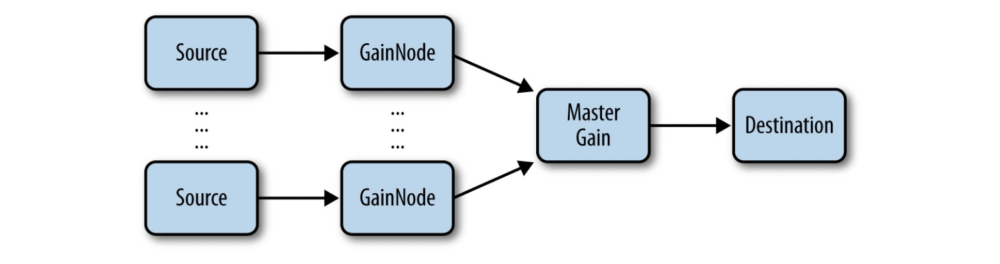
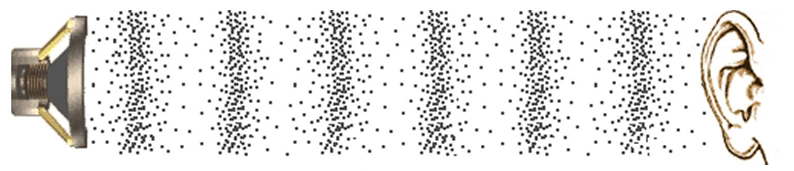

# Web Audio API 第1章 基础篇

> 我查了一下 Web Audio API 蝙蝠书居然在 2013 年就出版了
> 我又看了一下我的“豆瓣读书”频道内，这本书加入到“在读”标签是在 2021 年了
> 一直没有坚持看这本书的原因有两点，
> 一是本书是英文版的，不像中文看的那么流畅
> 二是在前端开发业务中一直没有遇到复杂到需要用到 Web Audio API 的场景
>
> 这不在 2023 年末业务上就遇上了需要处理音频的业务么，督促自己看下去，顺便翻译了
> 
> 因为此书已是 10 年前写的了，代码有些可能比较古早，我将会用 JavaScript 重新实现相关 demo
> 
> demo 会放在 https://github.com/willian12345/WebAudioAPI/tree/master/examples
>
> 我并非音乐相关专业人士，所以对一些专业用语可能翻的没那么专业，但这不重要，重要的就是先过一遍
> 对 Web Audio API 能做啥有个印象，用到的时候再仔细深入
>
> 总之没用的知识又可以增加了！！

> 译者 (王二狗 Sheldon 池中物) 注


## 正文开始

此章将描述从何处入手 Web Audio API, 哪些浏览器支持，如何检测哪些 API 可用，什么是音频可视化，音频节点是什么，如何将音频节点组合连接在一起，介绍一些基础的音频节点类型，最后加载音频并播放

## Audio 音频在网页中的历史小知识

最早在网页中播放音频使用的是 <bgsound> 标签，当有人访问网页时，网页创作者使用此标签就可自动播放背景音频。这个特性只能 IE 浏览器上可用，它从未被标准化或被其它浏览器所实现过。网景浏览器实现了一个类似的 <embed> 标签, 提供了相似的播放功能。

Flash 最早在网页中实现了跨浏览器播放音频的功能，但它有个比较大的缺点就是需要以插件方式运行。最近浏览器开发商都投向了 HTML5 <audio> 标签，现代浏览器上此标签提供了原生播放音频的能力。

尽管在网页上播放音频不再需要插件了，但 <audio> 标签在实现一些复杂的游戏和交互性应用时还是有些明显的限制，如下：

* 没有精确的可控定时器
* 一次可播放的音频数量太少
* 没有可靠的预缓冲能力
* 无法应用实时音频特效
* 没有可用的方法对音频进行分析


他们多次尝试推出强大的 audio API 来解决我上面提到的这些音频限制。推出的这些 API 中值得注意的就是火狐浏览器设计的 Audio Data API 原型实现。Mozilla 试图用 <audio> 标签对其 Javascript API 进行扩展额外的特性。但此 API 在音频的可视化上有限制(更多信息我将在第3章的" The Audio Context" 介绍)，它并未在后续超越 <audio> 的实现。此 API 现已被火狐浏览器丢弃


相比于 Audio Data API,  Web Audio API 使用了全新的模式，完全独立于 <audio> 标签的实现，尽管有些点与其它 web API 有相交（详见第7章）。它在 web 应用中提供了更高级的 Javascript API 用于处理和混合音频。此 API 的目的是实现现代游戏所需的能力，包括混音、处理、滤镜特效等这些只能在现代桌面应用程序产品所能提供的能力。最终需要的是一个多功能的 API 可以被用于处理多样的音频相关的任务，从游戏到可交互应用，到高级音频合成应用与可视化。


## 游戏与交互

音频是交互体验的重要组成部分。如果你不信，试着观看一部关掉声音的电影。

在游戏中更是如此！我最爱的电子游戏令我记忆最深的就是其中的音乐与音效。就算过了将近20年，塞尔达和暗黑破坏神的音效在我的脑海中仍然挥之不去。
无论是暴雪的《魔兽争霸》和《星际争霸》系列中的圈点士兵音效还是任天堂经典游戏中的各种音效，这些精心设计的游戏音效立马就可以被识别出来。

音效在游戏外的应用也同样重要。它们在命令行工具内交互之始就被应用于 UI 的交互上，当输出出错时就发出“哔”的一声。同样被应用现代交互 UI 上，一般用于提醒功能，铃声，也应用于音视频通讯比如 Skype。像 Google Now 和 Siri 这样的助手软件同样提供了丰富的音效反馈。当我们深入发掘这个世界，通用计算设备，语音和手势交互等可脱离屏幕的交互方式更加的依赖于音频的反馈。最后，对于视障视弱的计算机用户来说，音频提示，语音合成与识别提供了最主要的用户体验原则

可交互的音频也代表着一些有趣的挑战。为了创建合适的游戏音频，设计师需要调整好游戏玩家所有不可预知的状态。在实践中，游戏中某部分的时长可能是未知的，音效与周边环境交互产生更复杂的混音，需要环境特效音且取决于相关的音频位置。最终可能同一时刻播放着一堆音频，全都得组合在一起的音效即保证质量又不影响渲染性能


## Audio Context

Web Audio API 是建立在 audio context 音频上下文的概念之上的。音频上下文是描述音频所有节点的，这些节点定义了音频流是如何从起点(一般是音频文件)到目的地(一般就是你的扬声器)。当音频通过每个节点时，音频的属性可被修改和查看。最简单的音频上下文就是起始节点到结束节点的直连如图 1-1


图 1-1

一个音频上下文可能会非常复杂，在音频的起点与结束节点之间包含众多的音频节点（图1-2）进行任意众多的高级合成或分析。

图 1-1 和 1-2 方块表示音频节点。箭头代表节点之间的连接。这些节点经常拥有众多的输入和输出连接。默认情况下，如果一个音频节点拥有多个输入源，Web Audio API 会简单的混成一个音频信号。

音频节点图的概念并不新鲜，它来源于一些流行的音频处理框架，如 Apple 的 CoreAudio, 它提供了类似的音频处理 图像 API。它本身的概念很久远了，可追溯到1960年代的早期处理音频，比如 Moog 模块化混成系统（Moog modular synthesizer systems）。


图 1-2

## 初始化音频上下文

Web Audio API 现已被 Chrome 和 Safari 浏览器实现（包含 IOS 6 手机版 Safari ）并且通过 JavaScript 开放给了网页开发者。在这些浏览器上，音频上下文创建时需要加上 webkit 前缀，你不能直接使用 `new AudioContext` 而应该使用 `new webkitAudioContext` 创建。然而在未来在 API 足够稳定且多数浏览器供应商都实现了后前缀可去掉。Mozilla 已宣布在火狐浏览器上实现 Web Audio API，Opera 也开始参与进工作组。记得这一点即可，下面是通用的兼容写法：

```
var contextClass = (window.AudioContext || window.webkitAudioContext || window.mozAudioContext || window.oAudioContext || window.msAudioContext);
if (contextClass) {
  // Web Audio API is available. 
  var context = new contextClass();
} else {
  // Web Audio API is not available. Ask the user to use a supported browser.
}
```

一个音频上下文即可支持多个音频的输入与复杂的音频图谱，一般来讲，一个应用使用一个音频上下文即可。音频上下文的实例包含了众多的方法用于创建音频节点以及操作全局音频属性。幸运的是这些方法不需要加前缀，且相对稳定。 API 仍在变更，所以还是要小心会有大的变化。


## 音频节点的类型

音频上下文主要的一个功能就是创建新的音频节点。广义上来讲，一般包含以下几个节点类型：

* 源节点（Source nodes）
  音源，如音频缓冲，直播音频输入，<audio> 标签， 振荡器，以及 JS 处理器

* 修饰节点（Modification nodes）
  Filters, convolvers, panners, JS 处理器 等等

* 分析节点（Analysis nodes）
  分析器， JS 处理器
  
* 结束节点（Destination nodes）
  音频输出和结束处理缓存

音频源不限于音频文件，可用直播音频流或麦克风，<audio> 标签内的输出也可以 ，或者整个都是合成音频。尽管最终结束节点一般都是扬声器，不播放音频的情况下你也可以处理(例如，你只希望直接对音频进行可视化)或离线处理，将音频流保存起来用于后续使用。

## 连接音频图

使用 connect() 方法可以将任意音频节点输出连接至任意其它的音频节点。在以下例子，我们连接了音源节点的输出到 gain 节点，并将其输出连接到了结束节点：

```
// Create the source.
var source = context.createBufferSource(); 
// Create the gain node.
var gain = context.createGain();
// Connect source to filter, filter to destination.
source.connect(gain);
gain.connect(context.destination);
```

注意，`context.destination` 是一个特殊的节点，一般为系统的默认音频输出。上述代码形成的音频图如下 1-3：


图 1-3

一旦像上面这样我们连接了音频图就可以动态改变它。我们可以调用 `node.disconnect(outputNumber)` 来断开节点连接。例如，重新直连源音频节点至结束音频节点，避开中间 gain 节点 代码如下：

```
source.disconnect(0);
gain.disconnect(0);
source.connect(context.destination);
```

## 模块化路由的力量

在很多游戏中，通常要将多个音源最终混成一个声音。这些音源包含了背景音乐，游戏音效，UI反馈音，在多人游戏中还有其它玩家的聊天音频。Web Audio API 的一个非常重要的特性就是它允许你单独且完整的控制某个音或者组合在一起控制。音频图看起来应该像下面这样图 1-4：



我们分别使用 gain 音频节点将分开的声道音源联合在一起，并使用一个主 gain 节点来控制它们。 通过这样的设置，非常方便按需精准控制单独的声道级别。例如，非常多的用户在玩游戏过程中更喜欢把背景音关掉。


## 重要理论：什么是声音？

就物理上而言，声音是一种纵波（有时也被称为压力波）它们通过空气或其它媒介传播。 音源产生是由于空气内分子之间的振动与碰撞。它们的聚散导致了不同区域的高低压。如果你有能力冻结时间那么就可以观察到声波图像，可能类似于图 1-5



图 1-5

数学上来讲，声音可被表示为函数，通过时间轴上的压力范围值。 图 1-6 展示了函数图像。 可以看到它模拟的是图 1-5 ，值高的地方表示粒子稠密的区域（高压），值低则表示粒子稀疏的区域（低压）

首次捕获并重建声音的能力得追溯到 20 世纪初了。麦克风捕获压力波并转化成电子信号，（举例）用 +5 伏电压代表最高压，-5 伏电压代表最低压。与之相反，音频播放器获取这些电压并将其转换回压力波，这样我们才能听到。

无论我们是在分析声音还是合成声音, 对于音频编程者来说感兴趣的比特信息都在黑盒内操作音频信号图 1-7 。早期操作音频这个空间被模拟滤波器和其他硬件占据，按照今天的标准，这些硬件会被认为是过时的。现在有更多数字处理设备代替老的模拟设备。但在使用软件处理音频前，我们需要先将声音转换成电脑能处理的信息


图 1-7 声音的记录与回放

## 重要理论：什么是数字声音？

我们可以这样做，对模拟信号按时间进行一定频率的采样，对每个信号进行编码，编成一个数字。 对模拟信号的采样被称为采样率。一般音频软件处理通常采样率为44.1kHz。这意味着每一秒对声音进行记录 44100 个数值。这些数值限定在某个范围内。每个值通常分配一定数量的位，称为位深度(bit depth)。对于大多数数字音频录制，包括CD，位深度 16 对于大多数人来说足够了。

对于音乐发烧友来说，24位深度也够了，已经有足够的精度，使用再高的位深度人耳已很难区别开来了。

模拟信号转数字信号被称为数字化(或采样)，可抽象为 图 1-8


图 1-8 

在图 1-8 ，数字化信号的版本的长条与模拟信号版本光滑的曲线看起来区别非常大。随着采样率增高与采样深度的增加区别会越来越小（蓝色部分）。然而这些值的增加也意谓着更多存储内空间的付出。为了节约空间，电话系统通常使用的采样率低至 8 kHz, 因为使人类声音清晰可听的频率范围远远小于我们可听到的全部频率范围.

对于声音的数字化，计算机通常会像对待长数字的数组一样处理。这样的编码被称为脉冲编码调制 PCM(pulse-code modulation)。因为计算机非常善于处理数组，PCM 对于大多数数字音频应用来说是一个非常强大的基元。在 Web Audio API 的世界，长数字的数组的声音被表示为音频缓冲(AudioBuffer). 音频缓冲可以存储多条音频通道(通常在立体声中，包含左声道和右声道)被表示为标准化从 -1 到 1 后的浮点数数组。同样的信号当然也可以被表示为整形数组，在 16 位长度下，范围从 -215 至 215 - 1。


## 重要理论：音频编码格式

原始的音频 PCM 格式非常巨大, 它会造成额外的存储浪费，在下载时也会造成额外的带宽浪费。正因如此，音频通常会存储为压缩后的格式。有两种类型的压缩方式：有损压缩和无损压缩。无损压缩（如, FLAC）保证在压缩与解压后比特位信息完全相同。有损压缩(如，MP3) 利用人类听觉特性会丢弃掉部人类听不到的分比特位信息用于节约存储空间。有损压缩对于大多数人来说足够用了，音乐发烧友除外。

通常度量音频压缩量被称作比特率，它代表着重放每秒音频所需要的比特位数量。比特率越高单位时间内可利用的数据就越多所需的压缩就越少(更精确)。通常有损压缩格式，比如 MP3 定义为它们的比特率（一般为 128 到 192 Kb/s）。有损格式的编解码有可能使用任意的比特率。举个例子，电话人声音频通常使用 8Kb/s MP3 格式。一些格式支持可变比特率如 OGG 格式。比特率会随着时间变化而变。注意此处的比特率别和采样率或比特深度混淆了

浏览器对不同音频格式的支持差别很大。一般来说，如果是在浏览器上， Web Audio API 的实现与 <audio> 标签的实现是一样的。一般来说 WAV(一种简单的无损压缩格式)格式所有浏览器都支持。 MP3 仍然有专利阻碍，因为在一些纯开源的浏览器上不支持（比如，Firefox, Chromium）。不幸的是，不太流行但无专利阻碍的 OGG 格式在我写这篇文章时Safari 还是不支持。更多格式信息可查看这里 http://mzl.la/13kGelS

> Firefox Chrommium 现在是支持 mp3 格式的。


## 声音的加载与播放

Web Audio API 将缓冲与音源(source)节点区别的很清晰。这样的架构有利于解构音频资源与播放状态。以唱片机为例，缓冲区就像唱片，而源就像播放指针，而在 Web Audio API 的世界中你可以同时在多个播放指针处播放同一个唱片。由于许多应用程序涉及同一缓冲区的多个版本同时播放，因此这种模式是必不可少的。举个例子，
如果您希望快速连续地发出多个弹跳球的声音，则只需要加载一次弹跳缓冲并安排多个音源(source)。

在 Web Audio API 加载一个音频样本，我们可以使用一个 XMLHttpRequest 加载并对加载的结果用`context.decodeAudioData`进行音频解码处理。这些都是异步的不会阻塞主 UI 进程：

```
var request = new XMLHttpRequest(); 
request.open('GET', url, true); 
request.responseType = 'arraybuffer';
// Decode asynchronously
request.onload = function() {
  context.decodeAudioData(request.response, function(theBuffer) { 
    buffer = theBuffer;
  }, onError);
}
request.send();
```

> 此代码较老，用 fetch 请求数据更简单，我的 demo 里就是用 fetch 代替了 XMLHttpRequest

音频缓冲只是播放源的一种。其它播放源包括直接来自麦克风或其它音源输入设备，或者 <audio> 标签等等（见第7章）。

一旦你加载了缓冲，你可以为它创建一个(source node)源节点(AudioBufferSource Node)，把它连接到音频图并在源节点(source node)调用 `start(0)`。结束播放调用 `stop(0)`.注意，这两个函数在当前音频上下文的坐标系统调用都需要消耗时间（见第2章）

```
function playSound(buffer) {
  var source = context.createBufferSource(); 
  source.buffer = buffer; 
  source.connect(context.destination); 
  source.start(0);
}
```

游戏中通常都有循环播放的背景音乐。然而，需要注意不要过度重复你的选择：如果玩家被困在了某地或某个关卡，同样的样本在背景中不断播放，为了防止玩家沮丧，背景音声道的逐渐淡出可能是值得考虑的。另一种策略是根据游戏情境将不同强度的元素混合在一起（文章后续会提到）。


## 将它们整合在一起

如你所见以上的代码，Web Audio API 需要一些初始化的程序设置。在真正的游戏中，可以考虑围绕 Web Audio API 执行 JavaScript 抽象。例如后续的 BufferClass 类。它将所有东西都整合进一个简单的加载器上，加载器提供了设置路径，返回音频缓冲的功能。以下是如何使用 BufferLoader 类的代码：


```
window.onload = init; 
var context;
var bufferLoader;
function init() {
  context = new webkitAudioContext();
  bufferLoader = new BufferLoader( context,
            [
              '../sounds/hyper-reality/br-jam-loop.wav',
              '../sounds/hyper-reality/laughter.wav',
            ],
            finishedLoading
        );
  bufferLoader.load();
}

function finishedLoading(bufferList) {
    // 创建两具音源并把它们整合到一起播放
    var source1 = context.createBufferSource();
    var source2 = context.createBufferSource(); 
    source1.buffer = bufferList[0];
    source2.buffer = bufferList[1];
    source1.connect(context.destination);
    source2.connect(context.destination);
    source1.start(0);
    source2.start(0);
}
```
BufferLoader 类的实现可参 examples 文件夹下的 BufferLoader.js

