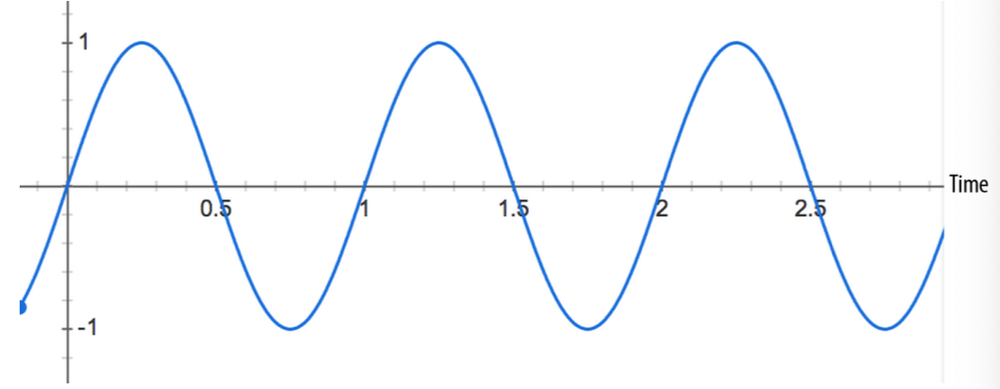

# Web Audio API 第2章 完美的播放时机控制

> Advanced Sound for Games and Interactive App

相较于 <audio> 标签 Web Audio API 拥有低延迟精确定时模型。 

低延时对于游戏或交互式应用来说非常重要，因为交互操作时要快速响应给用户的听觉。如果响应的不及时，用户就会察觉到延时，这种体验相当不好。

在实践中，由于人类听觉的不完美，延迟的余地可达20毫秒左右，但具体延迟多少取决于许多因素。精确的可控时间使得能够在特定时间安排事件。这对于脚本场景和音乐应用来说非常重要

## 时间模型

其中一个重要的点是，音频上下文 AudioContext 提供了一致的计时模型和时间的帧率。重要的是此模型有别于我们常用的 Javascript 脚本所用的计时器 如 setTimeout, setInterval, new Date()。也有别于 window.performance.now() 提供的性能分析时钟

在 Web Audio API 音频上下文系统坐标中所有你打交道的的绝对时间单位是秒而不是毫秒。当前时间可通过音频上下文的 currentTime 属性获取。同样它也是秒为单位，时间存储为高精度的浮点数存储。

## 精确的播放与复播

在游戏或其它需要精确时间控制的应用中 start() 方法用于控制安排精确的播放。为了保证正确运行，需要确保缓冲已提前加载。如果没有提前缓冲, 为了 Web Audio API 能解码，需要等等浏览器完成加载音频文件。如果没有加载或解码完毕就去播放或精准的控制播放那么很有可能会失败。

start() 方法的第一个参数可用于声音精确定位控制在哪里开始播放。此参数是 AudioContext 音频上下文坐标系内的 currentTime, 如果传参小于 currentTIme, 则它会立即播放。因为 start(0) 就是直接开始播放的意思 ，如果想要控制延迟 5 秒后播放，则需要 start(context.currentTime + 5)。

声音的缓冲也可以从特定位置开始播放，使用 start() 方法的第二个参数控制，第三个可选参数用于时长特殊限制。举个例子，如果我们想暂停后在暂停的位置重新开始恢复播放，我们需要实现记录声音在当前 session 播放了多久并追踪偏移量用于后面恢复播放

> start 方法即 AudioBufferSourceNode.start([when][, offset][, duration]);
>
> 可参考 https://developer.mozilla.org/zh-CN/docs/Web/API/AudioBufferSourceNode/start


```
// 假定 context 是网页 audio context 上下文
var startOffset = 0; 
var startTime = 0;
function pause() {
  source.stop();
  // 计算距离上次播放暂停时过去了多久
  startOffset += context.currentTime - startTime;
}
```

一旦源节点播放完毕，它无法再重播。为了重播底层的缓冲区，你需要新建一个新的源节点(AudioBufferSourceNode) 并调用 start():

```
function play() {
  startTime = context.currentTime;
  var source = context.createBufferSource();
  source.buffer = this.buffer;
  source.loop = true;
  source.connect(context.destination);
  // 开始播放，但确保我们限定在 buffer 缓冲区的范围内 
  source.start(0, startOffset % buffer.duration);
  
}
```

尽管重新新建一个源节点看起来非常的低效，牢记，这种模式下源节点被着重优化过了。请记住，如果你在处理 AudioBuffer， 播放同一个声音你无需重新请求资源。当 AudioBuffer 缓冲区与播放功能被分拆后，就可以实现同一时间内播放不同版本的缓冲区。如果你感觉需要重复这样的方式调用 ，那么你可以在将它封装成一个简单的方法函数比如 playSound(buffer) 就像在第一章代码片断中有提到过的。

以上代码实现 demo 可参考 examples/ch02/index1.html


## 规划精确的节奏

Web Audio API 允许开发人员在精确地规划播放。为了演示，让我们先设置一个简单的节奏轨道。也许最简单的要属广为人知的 爵士鼓模式（drumkit pattern） 如图 2-1，hihat每8个音符演奏一次，kick和snare在四分音符上交替演奏

>注： kick 是底鼓，就是架子鼓组里面最下面最大的那个鼓，声音是咚咚咚的；
>
>hihat是鼓手左边两片合在一起的镲片 闭镲 是次次次的声音，开镲是擦擦擦的声音
>
>snare 是离鼓手最近的平放的小鼓，叫军鼓，打上去是咔咔咔的声音；


假定我们已搞定了 kick, snare,和 hihat 缓冲，那么代码实现就比较简单：

```
for (var bar = 0; bar < 2; bar++) {
  var time = startTime + bar * 8 * eighthNoteTime; 
  // Play the bass (kick) drum on beats 1, 5 
  playSound(kick, time);
  playSound(kick, time + 4 * eighthNoteTime);
  // Play the snare drum on beats 3, 7
  playSound(snare, time + 2 * eighthNoteTime);
  playSound(snare, time + 6 * eighthNoteTime);
  // Play the hihat every eighth note.
  for (var i = 0; i < 8; ++i) {
    playSound(hihat, time + i * eighthNoteTime);
  } 
}
```

代码中对时间进行硬编码是不明智的。所以如果你正在处理一个快速变化的应用程序，那是不可取的。处理此问题的一个好方法是使用JavaScript计时器和事件队列创建自己的调度器。这种方法在《双钟的故事》中有描述

>译者注：《双钟的故事》即 《A Tale of Two Clocks》 寓言故事大致告诉人们不能依靠单独一种方式，需要依靠多种方式方法解决问题

> 译者注：具体音乐原理不重要，重要的是反应出可对音频延时播放, 听的就是个“动次打次”


以上代码实现 demo 可参考 https://github.com/willian12345/WebAudioAPI/tree/master/examples/ch02/index2.html


## 更改音频参数

很多音频节点类形的参数都是可配的。举个例子，GainNode 拥有 gain 参数用于控制通过 gain 节点的声音音量乘数。特别的一点是，参数如果是1则不影响幅度，0.5 降一半，2 则是双倍。让我们设置一个：

>译者注： gain节点或称增益节点通常用于调节音频信号的音量


```
  // 创建 gain node.
  var gainNode = context.createGain();
  // 连接  source 到 gain node. 
  source.connect(gainNode);
  // 连接  gain node 至  destination. 
  gainNode.connect(context.destination);
```

在 context API 中，音频参数用音频实例表示。这些值可通过节点直接变更：

```
// 减小音量
gainNode.gain.value = 0.5;
```

当然也可以晚一点修改值，通过精确安排在后续更改。我们也可以使用  setTimeout 来延时修改，但它不够精确，原因有几点：

1. 毫秒基数的计时可能不够精确
2. 主 JS 进程可能很忙需要处理更高优先级的任务比如页面布局，垃圾回收以及其它 API 可能导致延时的回调函数队列等
3. JS 计时器可能会受到浏览器 tab 的状态影响。举个例子，interval 计时器相比于 tab 在前台运行时，tab 在后台运行时触发的更慢

我们可以直接调用  setValueAtTime() 方法来代替直接设值，它需要一个值与开始时间作为参数。举个例子，下面的代码片断一秒就搞定了 GainNode的 gain 值设置

```
gainNode.gain.setValueAtTime(0.5, context.currentTime + 1);
```

以上代码实现 demo 可参考 https://github.com/willian12345/WebAudioAPI/tree/master/examples/ch02/index3.html

## 渐变的音频参数

在很多例子中，相较于直接硬生生设置一个参数，你可能更倾向于渐变设值。举个例子，当开发音乐应用时，我们希望当前的声音轨道渐隐，然后新的声音轨道渐入而避免生硬的切换。当然你也可以利用多次调用 setValueAtTime 函数的方法实现类似的效果，但显然这种方法不太方便。

Web Audio API 提供了一个堆方便的 RampToValue 方法，能够渐变任何参数。 它们是 linearRampToValueAtTime() 和 exponentialRampToValueAtTime()。两者的区别在于发生变换的方式。在一些用例中，exponential 变换更加敏感，因为我们以指数方式感知声音的许多方面。

让我们用一个例子来展示交叉变换吧。给定一个播放列表，我们可以在音轨间安排变换降低当前播放的音轨音量并且增加下一条音轨的音量。两者都发生在当前曲目结束播放之前稍早的时候：

```
function createSource(buffer) {
  var source = context.createBufferSource(); 
  var gainNode = context.createGainNode(); 
  source.buffer = buffer;
  // Connect source to gain. 
  source.connect(gainNode);
  // Connect gain to destination. 
  gainNode.connect(context.destination);
  return {
    source: source, 
    gainNode: gainNode
  }; 
}

function playHelper(buffers, iterations, fadeTime) { 
  var currTime = context.currentTime;
  for (var i = 0; i < iterations; i++) {
    for (var j = 0; j < buffers.length; j++) { 
      var buffer = buffers[j];
      var duration = buffer.duration;
      var info = createSource(buffer);
      var source = info.source;
      var gainNode = info.gainNode;
      // 渐入
      gainNode.gain.linearRampToValueAtTime(0, currTime); 
      gainNode.gain.linearRampToValueAtTime(1, currTime + fadeTime);
      // 渐出
      gainNode.gain.linearRampToValueAtTime(1, currTime + duration-fadeTime);
      gainNode.gain.linearRampToValueAtTime(0, currTime + duration);
      // 播放当前音频.
      source.noteOn(currTime);
      // 为下次迭代累加时间
      currTime += duration - fadeTime;
    }
  } 
}
```


> 译者注： 原文中的代码过时了, 实际实现请参考我的 demo 实现
>
> 标准 https://webaudio.github.io/web-audio-api/#dom-gainnode-gain

以上代码实现 demo 可参考 https://github.com/willian12345/WebAudioAPI/tree/master/examples/ch02/index4.html


## 定制时间曲线

如果线性曲线和指数曲线都无法满足你的需求，你也可以自己定制自己的曲线值通过传递一个数组给 setValueCurveAtTime 函数实现。有了这个函数，你可以通过传递数组实现自定义时间曲线。它是创建一堆 setValueAtTime 函数调用的快捷调用。举个例子，如果我们想创建颤音效果，我们可以通过传递振荡曲线作为 GainNode 的 gain 参数值，如图 2-2



上图的振荡曲线实现代码如下：

```

var DURATION = 2; 
var FREQUENCY = 1; 
var SCALE = 0.4;
// Split the time into valueCount discrete steps.
var valueCount = 4096;
// Create a sinusoidal value curve.
var values = new Float32Array(valueCount); 
for (var i = 0; i < valueCount; i++) {
  var percent = (i / valueCount) * DURATION*FREQUENCY;
  values[i] = 1 + (Math.sin(percent * 2*Math.PI) * SCALE);
  // Set the last value to one, to restore playbackRate to normal at the end. 
  if (i == valueCount - 1) {
    values[i] = 1;
  }
}
// Apply it to the gain node immediately, and make it last for 2 seconds.
this.gainNode.gain.setValueCurveAtTime(values, context.currentTime, DURATION);
```


上面的代码片断我们手动计算出了正弦曲线并将其设置到 gain 的参数内创造出颤音效果。好吧，它用了一点点数学..

这给我们带来了 Web Audio API 的一个非常重要的特性, 它使得我们创建像颤音这样的特效变的非常容易。这个重要的点子是很多音频特效的基础。上述的代码实际上是被称为低频振荡(LFO)效果应用的一个例子， LFO 经常用于创建特效，如 vibrato 震动 phasing 分队 和 tremolo 颤音。通过对音频节点应用振荡，我们很容易重写之前的例子：

```
// Create oscillator.
var osc = context.createOscillator(); 
osc.frequency.value = FREQUENCY;
var gain = context.createGain(); 
gain.gain.value = SCALE; 
osc.connect(gain); 
gain.connect(this.gainNode.gain);
// Start immediately, and stop in 2 seconds.
osc.start(0);
osc.stop(context.currentTime + DURATION);
```
> createOscillator https://developer.mozilla.org/en-US/docs/Web/API/OscillatorNode

相比于我们之前创建的自定义曲线后面的代码要更高效，重现了效果但它帮我们省了用手动循环创建正弦函数


以上振荡器节点的代码实现 demo 可参考 https://github.com/willian12345/WebAudioAPI/tree/master/examples/ch02/index5.html


