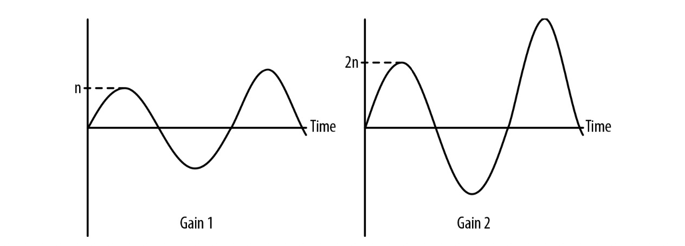
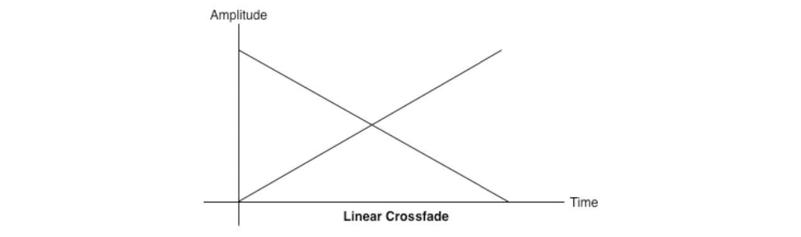
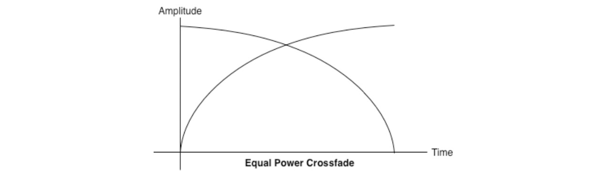
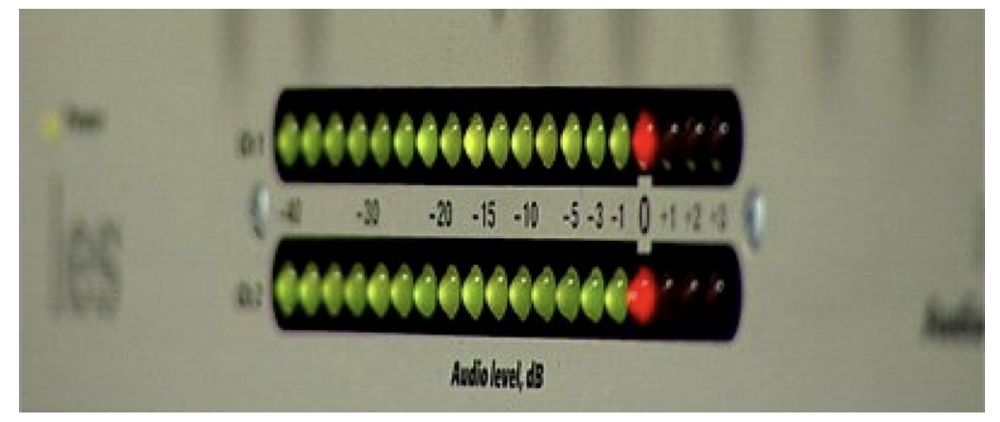
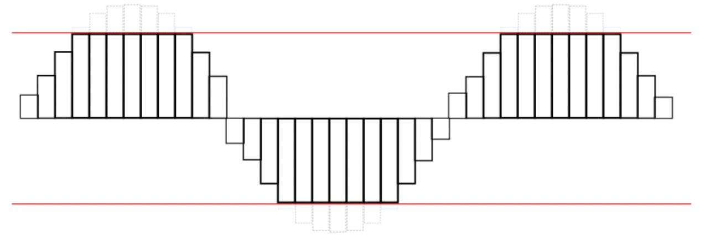
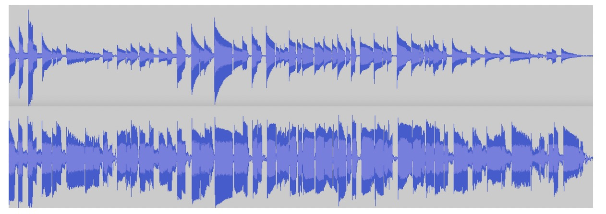
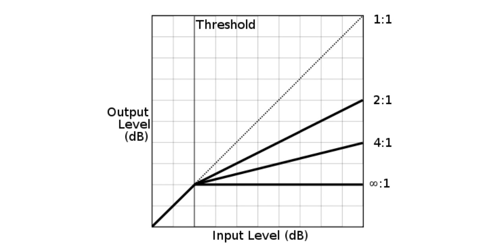

# 音量和响度

> Loudness 响度 注：根据《韦氏词典》，响度是“一种声音的属性，它决定了所产生的听觉感觉的大小，主要取决于所涉及声波的振幅。”这意味着响度取决于你大脑中感知到的声音。而是声音对你来说有多大。这是主观的——例如，对你来说很响的声音对有听力问题的人来说可能听不到
>
> Volume 音量 注：我们通常用在收音机、电视、立体声或其他乐器上。你可以用控制按钮或滑块来控制响度。即使响度仍然是基于你的感知，乐器也可以以不同的水平播放音频

一旦我们准备与声音打交道，无论是 AudioBuffer 还是其它来源的声音，最基本的可控参数就是声音的响度

最主要可以影响音量响度的方式就是使用 GainNode。正如之前提到过的，音频节点都有一个 gain 参数，作为声音输入缓冲的乘数。默认值是 1，意为着没有任何影响。值从 0 至 1，如果值超过了 1 则放大了输入声音的响度。将 gain 值设为负值(值小于0) 则波形反转(幅度翻转了)。


## 重要理论： 音量(Volume)，增益(Gain) 和响度(Loudness)

让我们从它们的定义开始。响度是我们耳朵理解声音的主观衡量。音量是从物理声波振幅来衡量。增益则是处理声波过程中对其波形振幅乘数缩放。

换句话来说，增益时一个声音波形的振幅乘以增益乘数后被缩放了。举个例子，当值为 1 时不影响声音波形，图 3-1 图示了当声音波形通过增益值为2的节点后的结果



图 3-1  左侧是原波形，右侧是增益2后的波形

一般来说，波的功率以分贝(decibels, 缩写为dB)或贝尔的十分之一来测量，贝尔以亚历山大·格雷厄姆·贝尔命名。分贝是相对的，将被测量的等级与某个参考点进行比较的对数单位。有多种不同的参考点用于测试分贝，每一种参考点都有着指示前缀单位。没有参考点说信号的分贝是无意义的！举个例子，dBV, dBu, 和 dBm 都是非常有用的衡量电信号方式。由于我们仅关心数字音频，我们主要关心两种测量方式： dBFS 和 dBSPL

第一种 dBFS (decibels full scale) .音频设备产生的最高声级是0 dBFS。** 所有其他级别都以负数表示 **.

dBFS 的数学描述如下：

```
dBFS = 20 * log( [sample level] / [max level] )
```

dBFS 最大值 在 16位音频系统中：

```
max = 20 * log(1111 1111 1111 1111/1111 1111 1111 1111) = log(1) = 0
```

注意，dBFS 由定义可得最大值总是为 0 

最小 dBFS 值在类似的系统中是：

```
min = 20 * log(0000 0000 0000 0001/1111 1111 1111 1111) = -96 dBFS
```

** dBFS 衡量的是增益而非音量。** 你可以试试 0-dBFS 将立体声节点增益设为最小值，这样应该几乎就听不到了。相反如果是 −30-dBFS这样的低音量，如果设一个最大的增益值，那么依然可能将你的耳膜吹破。

尽管如此，你还是很可能听到有人跟你用分贝来描述用音量。从技术上讲，他们指的是dBSPL，(decibels relative to sound pressure level)即分贝相对声压等级的。这里，参考点是每平方米0.000002牛顿(大约是蚊子在3米外飞行的声音)。dBSPL 没有上限，但在实践中，我们希望保持在耳朵损伤水平(~120 dBSPL)以下，远低于疼痛阈值(~150 dBSPL)。Web Audio API 不使用 dBSPL，只使用 dBFS 这是因为最终音量取决于操作系统的增益和杨声器的增益。

分贝的对数定义在某种程度上与我们的耳朵感知声响的方式有关， 但响度依然是时分主观的概念。将一个声音的dB值与具有2倍增益的相同声音进行比较，我们可以看到差值大约是 6dB


```
diff = 20 * log(2/2^16) - 20 * log(1/2^16) = 6.02 dB
```


每次增加 6dB 左右，我们实际是对信号放大了双倍。对比摇滚音乐会(~110 dBSPL) 与你的闹钟(~80 dBSPL), 两者之差是 (110 − 80)/6 dB，或大概是5倍大小，即增益乘数2^5 = 32倍。立体音响的旋钮音量调节也是标准的指数增幅。也就是说音量旋钮转3个刻度单位意即音信号增大2的3次方也就是8倍。在此用指数模型描述仅仅是近似我们人耳认知的声响，而音响生产商一般都有自己的定制化增益曲线它即不是线性也不是指数形。

>注：人耳对舒适声音的范围一般在20-40分贝之间，犹如轻声絮语。一般情况下，人体所能承受的音量是在80分贝以下，如果长期在80分贝以上的环境生活，就会出现头痛，记忆力衰减以致失眠等症状。当人耳听到的音量达100分贝时，时间较长可造成不可恢复性的听力损伤；长时间受120分贝以上音量的刺激，听觉细胞就会受到永久性的破坏，严重者还会造成听力丧失。


## 等功率交叉渐变(crossfade)

在游戏开发中，你会遇到一种情况，就是在两个拥有不同声音的环境中交叉渐变(crossfade), 然而什么时候渐变，渐变多少不是提前已知的; 很有可能是根据玩家的位置而变化的，这取决于玩家对角色的控制位置。所以在这种情况下，我们无法做到自动计算。

通常，直接进行线性渐变会得到以下图。它可能听起来不平衡，因为两个样本之间的音量下降，如图 3-2



图 3-2 两条音轨的线性交叉渐变

为了解决这种情况，我们使用等功率曲线，其中相应的增益曲线既不是线性的也不是指数的，它会在更高的振幅处相交图 3-3 。这有助于当两个声音均匀地混合在一起时避免在交叉渐变的中间部分音量下降。



图 3-3 等功率曲线线性交叉渐变要好的多

图 3-3 用一点点数学就能搞定：

```
function equalPowerCrossfade(percent) {
  // Use an equal-power crossfading curve:
  var gain1 = Math.cos(percent * 0.5*Math.PI);
  var gain2 = Math.cos((1.0 - percent) * 0.5*Math.PI); 
  this.ctl1.gainNode.gain.value = gain1; 
  this.ctl2.gainNode.gain.value = gain2;
}
```

## 重要理论: 裁剪和计量

就像图片边界超过 canvas ，声音波形如果超出最大值限制也可以被裁剪。这种显著的失真肯定是不能接受的。为了不让工程师和用户感知处理音频时不被裁剪，音箱设备通常会提供指示器显示音频数值等级。这些指示器被称为 meters (图 3-4)，它通常有一个绿色区域(不裁剪)，黄色区域（接近裁剪区），红色区（裁剪）。



图 3-4

被裁剪的声音看起来和听起来都不太好。重要的是要听刺耳的失真，或者相反，过度柔和的混音，迫使你的听众调大音量。如果你处于以上任何一种情况，请继续往下读


## 使用仪表检测与阻止裁剪

由于同时播放的多个声音是叠加的，这些声音音量没有降低级别，你可能会发现自己处于超出扬声器能力阈值的情况。16位的音频音量最高级 是 0 dBFS, 或 216。在信号的浮点数版本中，这些比特值都映射到了 [-1, 1]. 声音的波形被裁剪看起来像是图 3-5， 在 Web Audio API 上下文中，传递给目的节点（destination node）值如果超过了目的节点设备的范围则会发生裁剪。给最后混音留出一些空间(称为 headroom) 的做法就很好，这样你就不会太接近裁剪阈值了。



图 3-5 波形被裁剪的示意图


除了仔细聆听之外，您还可以通过将脚本处理器节点放入音频图中来检查是否以编程方式截取声音。如果任何 PCM 值超出可接受范围，可能会发生剪切。在这个示例中，我们检查左通道和右通道的裁剪，如果检测到裁剪，则保存最后的裁剪时间：

```
function onProcess(e) {
  var leftBuffer = e.inputBuffer.getChannelData(0); 
  var rightBuffer = e.inputBuffer.getChannelData(1); 
  checkClipping(leftBuffer); 
  checkClipping(rightBuffer);
}

function checkClipping(buffer) {
  var isClipping = false;
  // 检测循环迭代 buffer 是否超出值 1
  for (var i = 0; i < buffer.length; i++) {
    var absValue = Math.abs(buffer[i]); 
    if (absValue >= 1.0) {
      isClipping = true;
      break; 
    }
  }
  this.isClipping = isClipping; 
  if (isClipping) {
    lastClipTime = new Date(); 
  }
}
```

测量的另一种实现方式是在音频图内轮询一个实时解析器，在渲染时为 getFloatFrequencyData，它取决于 requestAnimationFrame 方法（见第5章）。这种方式更高效，但信号丢失的比较多(包含用于可能裁剪的空间位置)，由于渲染大多是每秒 60次，而音频信号相对变化的更快

阻止裁剪的方式是降低信号总电平。如果您正在进行音频剪辑，请在主音频增益节点上应用一些分数增益，以使您的混音降低到阻止裁剪。一般来说，你应该调整增益来预测最坏的情况, 但把它调的更好则是一种艺术而非科学的事儿了。由于游戏或交互式应用程序中播放的声音可能取决于运行时决定的各种因素，因此很难在所有情况下选择阻止裁剪的主增益节点值。对于这种不可预测的情况，请考虑动态压缩( Dynamics Compression )


## 重要理论： 理解动态范围

> 动态范围：音频或广播系统能够传输或重现的最强和最弱声音强度之比， 具体来说，最强声音强度指的是系统能够产生或传输的最大响度或音量，而最弱声音强度则指系统能够检测或重现的最小响度或音量。这个比例反映了系统在声音强度方面的表现力和分辨率。
>
>较高的声音强度之比意味着系统能够呈现出更明显的音量差异，从而提供更丰富的音频细节和动态范围。例如，一个具有较大声音强度之比的系统可以更好地表现出轻柔的声音和强烈的声音，使听众能够感受到更广阔的音频频谱和更强的音频冲击力。
>
>相反，较小的声音强度之比可能意味着系统在处理音量差异方面的能力较弱，可能会导致一些细节丢失或音频表现力的受限。
>
在音频领域，动态范围是声音的最高音与最低音的之间的部分。音乐作品的动态范围因流派而异。经典音乐拥有大的动态范围并且有非常安静的部分常伴有跟着的相关的响亮部分。而流行音乐如摇滚和电子乐则倾向于小的动态范围，并且由于明显的竞争(被蔑称为“响度战争”)来提高音高以满足消费者的需求，所以声音都很响。这种均匀的响度通常是通过使用动态范围压缩来实现的。

有多种合理的动态压缩手段可用。有时候录制的音乐有一个大的动态范围，其中有非常高和非常低的片段以至于听者需要不断用手指调节音量旋钮。压缩可以使大声的部分安静下来，同时使安静下来的部分可以被听到 图 3-6 展示了波形上图是正常波形图下图是压缩后的。你可以看到声音都变大了，且振幅差异也小了。



在游戏和交互式应用中，你可能事先不知道你的声音输出会是什么样子。由于游戏天然的动态性，你可能需要在一个非常安静的音频周期（比如,鬼鬼祟祟的溜）后跟一个高音(比如,游戏《使命召唤：战争地带》)。一个压缩节点对需要处理声音突然变高音的情况下下非常有用，可以降低被裁剪的可能性。

压缩器可以用包含多个参数的压缩曲线来建模，所有这些参数都可以通过 Web Audio API 进行调整。两个主要的的可调参数是 threshold 和 ratio。Threshold 阈值是指压缩器 开始减小动态范围的最低音量。ratio 比率决定了压缩器应用多少增益降低。图 3-7 阐述了阈值与变化的压缩比率在压缩曲线上的影响效果。





## 动态压缩

压缩器在 Web Audio API 中也能使用被叫做 DynamicsCompressorNodes。使用温和的动态压缩量在混音中是比较好的做法，特别是在我们之讨论过的在不知道何时何地播放声音游戏设置中。有一种情况下应该避免使用压缩，那就是在曲目被故意设计成这样，因为已经被精确调好，它不应该再和其它通道混合了。

在 Web Audio API 内实现动态压缩比较简单，只要在音频图内引入一个动态压缩器节点，一般就是在目标节点之前：

```
var compressor = context.createDynamicsCompressor(); 
mix.connect(compressor); 
compressor.connect(context.destination);
```
此节点还可以被配置一些额外的参数，正如描述过的理论章节中所述，但对于大多数情况默认值已经相当棒。更多关于压缩曲线的配置信息，可以查看 Web Audio API 说明书


