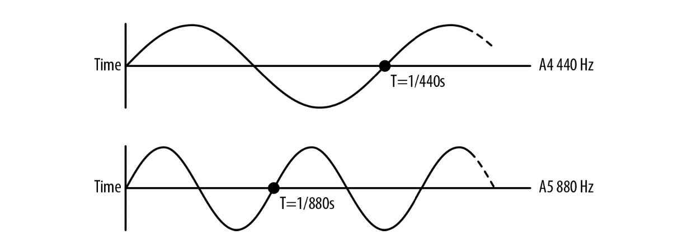
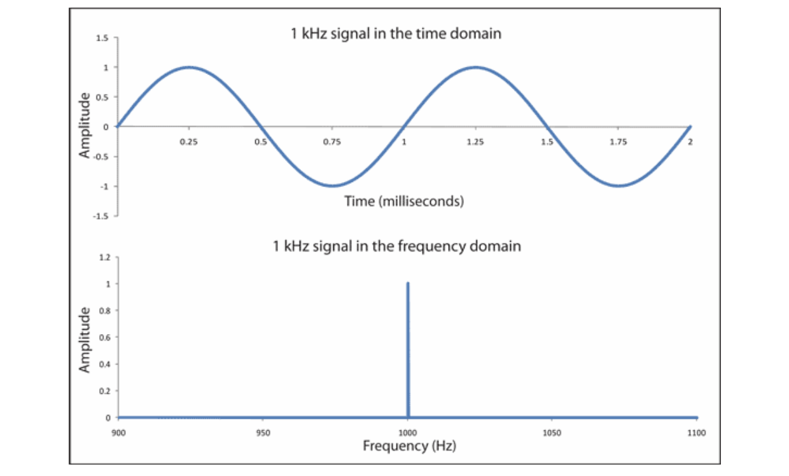
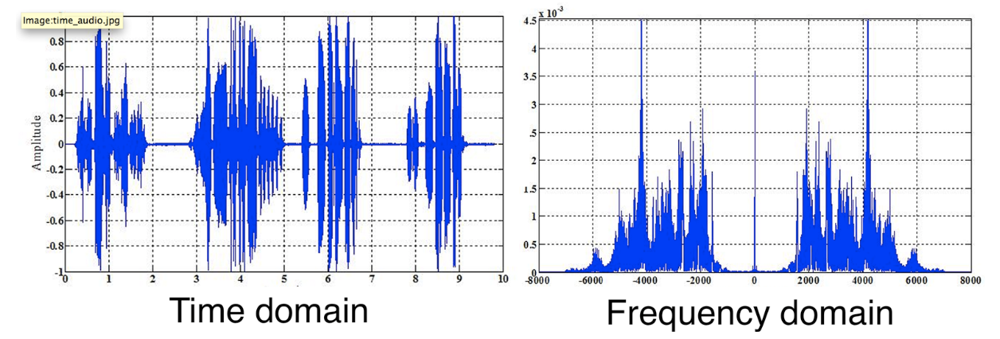
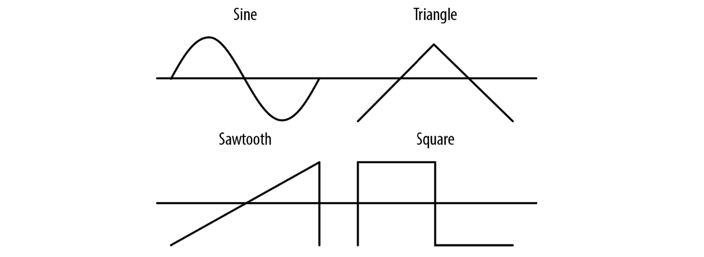

# 音调与频域

到目前为止我们已经学过了声音的基础属性：定时与音量。为了能处理更复杂的的情况，例如声音的均衡(比如，增加低音和降低高音)，我们需要更复杂的工具。此章节将介绍一些用于更有趣的转换工具，这些工具能模拟不同的声音环境并且可以直接使用 JavaScript 操作。


## 重要理论：音调基础

音乐是由多种声音同时播放所构成的。由乐器产生的声音可以非常的复杂，因为声音通过乐器的各个部分反射，并以独特的方式形成。然而这些音调都有共同的特征：从物理上讲，它们都是周期性的波形。这些周期波形在我们耳朵听来就是音调。衡量音的音调由频率决定，每秒重复波形的次数被叫作赫兹。频率是波峰之间的时间差(单位为秒)。如图 4-1 所示，如果我们时间维度减半，我们最终得到的是相应加倍的频率，同样的音色，高一个八度。与之相反，如果我们将频率延展两倍，这会使音色降低一个八度。所以，我们的耳朵感知到的音调（就像音量）是指数级地：每一个八度，频率翻一倍。

> 注：八度音，是指两个音之间的音高距离，其中一个音的频率是另一个音的两倍
> 
> 注： 国际标准音高 A4 为 440 赫兹， 比 A4 高一个八度的 A5 即为 880 赫兹，比 A4 低一个八度的 A3 则为 220 赫兹
>




图 4-1

八度音分成12个半音。每个相邻的半音对具有相同的频率比（至少在同等程度上的音调是这样）, 换句话说， A4 到 A#4 的比率 与 A#4 到 B 是相等的。

> A#4 在音乐中表示一个音符， A# 指 A 音升高半音的表示方法，4 指的是音高的位置

图 4-1 展示了我们如何推导每个连续半音之间的比例。得到的结论：

1. 为了把一个音符向上转一个八度，我们把这个音符的频率加倍
2. 每个八度音分成12个半音，同等程度的音调拥有相等的频率比

让我们定义 f0 表示某个频率， f1 表示高八度的同音。我们知道它们之间的关系：

f1 = 2 * f0

接下来，设 k 作为 两个连续半音间的乘数。由于八度音阶有12个半音，可得：

f1 = f0 * k *  k * k * ... * k(12x) = f0 * k^12

解上面的方程组，得：

2 * f0 = f0 * k^12

解得 k：

k = 2^(1/12) = 1.0595...


其实没那么麻烦，所有这些与半音相关的偏移实际上都不需要手动执行，因为很多音频环境(包括 Web Audio API)包含了失谐(detune)的概念，它使频域线性化。Detune 的单位是分，每个八度包含 1200 分, 每个半音包含了 100 分。通过指定1200的调谐，就提高了一个八度，指定 -1200 则降低一个八度。


## 音调(Pitch) 与 playbackRate

Web Audio API 在每个 AudioSourceNode 上提供了一个 playbackRate 参数。这个参数值可以影响任何 sound Buffer。注意，在这种情况下，音高和样本的时长都会受到影响。有一些复杂的方法试图只影响音高而不影响音频的时长，但是要以通用的方式做到这一点是非常困难的，否则就会在混合中引入奇奇怪怪的东西。


在“重要理论：音调基础”一节中讨论过, 我们简单的通过半音比率 2^(1/12) 乘以频率计算出连续的半音频率. 如果你正在开发一种乐器或在游戏设置中使用随机音调，这将非常有用。下面的代码演示了在半音中以给定的频率偏移音调：

```
function playNote(semitones) {
  // 假定新的 source 从 buffer 中创建了.
  var semitoneRatio = Math.pow(2, 1/12); 
  source.playbackRate.value = Math.pow(semitoneRatio, semitones); 
  source.start(0);
}
```


正如我们之前讨论过的那样，我们的耳朵是以指数级感知音调的。将音调当作指数量对待是不方便的，这样的话我们会经常和一些怪怪的值打交道比如 2 的 12 次方根。取而代之的是我们可以使用失谐参数(detune) 指定要偏移多少分。 所以你可以以更简单的方式重写上面的失谐函数了：

```
function playNote(semitones) {
  source.detune.value = semitones * 100; 
  source.start(0);
}
```

如果你的音调转了太多的半音(比如，playNote(24)), 你会开始听到失真。正因如此，数字钢琴为每个乐器包括多个样本。好的数字钢琴完全避免音高弯曲，并包括为每个键专门录制的单独样本。
优秀的数字钢琴通常为每个键包含多个样本，这些样本会根据按键的速度回放


## 多个声音多种变化

在游戏中的一个重要特点就是会同时播放多个音效。想象一下在射击游戏内多角色用机枪扫射的效果。每把机枪每秒多次扫射，这会同时播放十多种音效。用相同的资源播放实现不同的效果这正是 Web Audio API 的亮点。

如果枪声效果都是都一种，那就显得单调了，就算声音根据目标距离的不同而变化（稍后会讨论到“Spatialized Sound” 空间音频），但这效果显示还不够。幸运的是 Web Audio API 提供了之前例子中提到过的可简单改变音效的至少两种方式：

1. 子弹发射期间的轻微变化

2. 通过改变音调模拟真实世界的随机

利用我们已掌握的时间与音调的知识，实现这两种效果就相当简单直接了：

```
function shootRound(numberOfRounds, timeBetweenRounds) {
  var time = context.currentTime;
  // 使用同一个 buffer 实现快速连续播放多种音效
  for (var i = 0; i < numberOfRounds; i++) {
    var source = this.makeSource(bulletBuffer);
    source.playbackRate.value = 1 + Math.random() * RANDOM_PLAYBACK; 
    source.start(time + i * timeBetweenRounds + Math.random() * RANDOM_VOLUME);
  } 
}
```


Web Audio API 会在播放时自动一次性合并，本质上就是将多个音频波形叠加在一起。这会导致一些问题比如音频被裁剪，这我们之前已经讨论过了。此例中在加载的音频文件的 AudioBuffer 上添加了一些变化。在完全合成的音频情况下，这点小缺点是值得接受的。


## 重要理论：理解频域(Frequency Domain)

到目前为止，我们的理论讨论，我们只研究了声音随时间变化的压强函数。另一种观察声音的有用方法是绘制振幅，看看它是如何随频率变化的。

时域和频域图之间的关系图是基于傅立叶分解。正如之前所见，自然界中音波经常是周期循环。在数学上来讲，周期性的音波可视作一系列简单的不同幅度与频率正弦波的叠加。越多的正弦波叠加，越能更准确的模拟原函数。通过。傅立叶变换我们可以找到组成信号的各个正弦波，更多的细节已超出本书讨论的范围。存在很多算法也能达到相同的目的，比较知名的算法是  Fast Fourier Transform（FFT）。好消息是 Web Audio API 实现了这一算法。我们后面会讨论到。

一般来说，我们可以取一个声波，算出其组成的波，在新图上以点（频率，振幅）的形式绘制得到频域图。

如图 4-2 展示了存一个 440Hz 的纯音符（称为 A4）




图 4-2 一个完美的 1-KHz 正弦波在时间与频域上的表示


让我们关注在频域上，我们可以更好的感受到声音的质量，包括音调内容，噪声，等等。高级的音调检测算法就是基于频域。真实乐器产生的声音都包含泛音(overtones) , 所以 A4 被钢琴演奏出的频域图和小号演奏出的同一个声调看起来非常不一样。不管声音的复杂性如何，同样的傅里叶分解思想都适用。图 4-3 展示了一个更复杂的音频片断的频域。



图 4-3 一个更复杂的音频片断的时域和频域

随着时间的推移，这些图上表现非常不同。如果你非常慢速地回放图 4-3 中的声音，并观察它沿着每个图象移动，您会注意到时域图是(在左边)从左向右分析记录移动。频域图(右侧)是波形在某一时刻的频率分析，它可能变化的更快更不可预测。

重要地是，当检测的声音不被认为具有特定的音调时，频域分析研究声音时还是时分有用的。风声，敲击声，枪声，在频域上有着明显的区别表达。举个例子，白噪声拥有的是比较平坦的频域频谱范围，这是因为每个频率都是相等的。

## 基于振荡器（oscillator）的直接声音合成

正如本书早前讨论过的，声音信号在 Web Audio API 中被表示成 AudioBuffer 浮点数组形式。大多情况下， buffer 缓冲是从加载的一个声音文件或者从声音流创建的。在一些项目中，我们可能希望合进自己的声音。我们可以通过JavaScript 来进它进行编程创建 audio buffer，简单的数学函数周期计算得到值并把值赋值给数组。通过这种方法，我们可以手动更改正弦波的幅度与频率，甚至联合多个正弦波创建任意的声音 [ 回想一下之前提到的傅里叶变换 ]。

想象中用 JavaScript 来做这些工作可能低效且复杂。但是 Web Audio API 提供了原函数让你使用振荡器来实现：振荡器节点(OscillatorNode). 这些节点拥有可配置的频率和失谐。它们也有着自己这一类的波形。内建有 正弦，三角，锯齿，方波，如下图示：



图 4-4，振荡器（oscillator）能计算得到的几种声波图

利用 AudioBufferSourceNodes 振荡器（oscillator）可以很方便的在音频图中使用。以下是一个例子：

```
function play(semitone) {
  // Create some sweet sweet nodes.
  var oscillator = context.createOscillator(); 
  oscillator.connect(context.destination);
  // Play a sine type curve at A4 frequency (440hz). 
  oscillator.frequency.value = 440; 
  oscillator.detune.value = semitone * 100;
  // Note: this constant will be replaced with "sine". 
  oscillator.type = oscillator.SINE; 
  oscillator.start(0);
}
```

除了这些基本的波类型，你还可以使用谐波表为你的振荡器创建一个自定义的波表, 这样你就可以更高效的创建比上面这个例子中更复杂的波形。这在音乐合成应用中时分重要，但这超出了本书讨论的范围。


