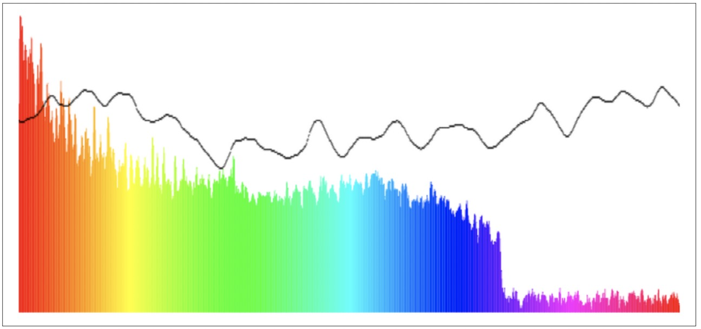
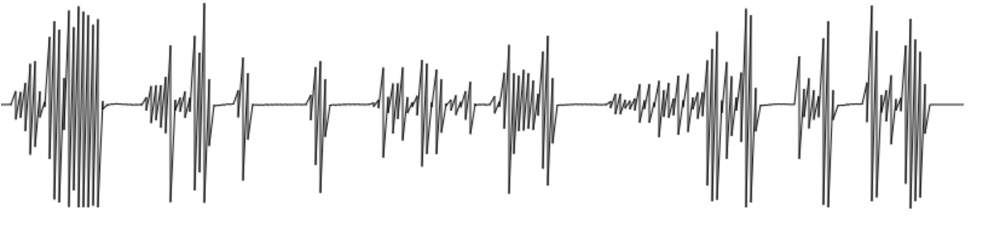
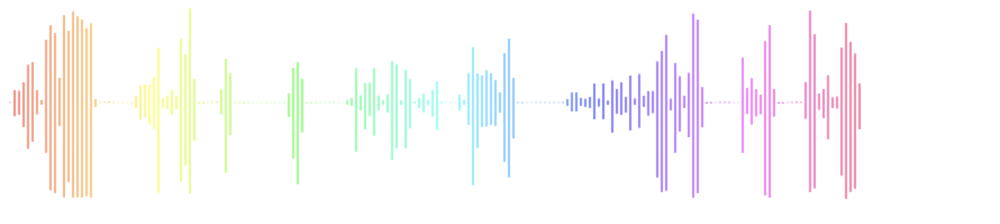
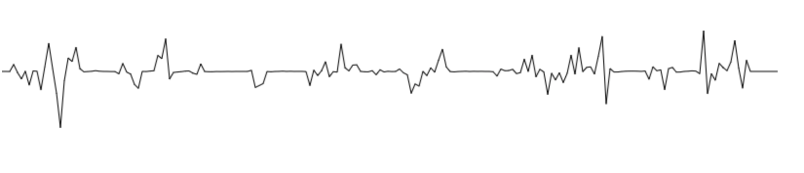

# 分析与可视化

到目前为止，我们仅讨论了音频的合成与处理，但这仅是 Web Audio API 提供的一半功能。另一半功能则是音频的分析，它播放起来应该是什么样子的。它最典型的例子就是音频可视化，但其实有更多的其它应用场景，包括声调检测，节减检测，语音识别等，这些已大大超出本书范围。

对于游戏或交互式应用开发者来说，这是一个重要的主题，原因有几点。首先，一个好的可视化分析器可以用于类似调式工具（显然这是除了你耳朵之外，良好的计量工具）用于调音。其次，对于某些关于音乐相关的游戏或应用来说可视化是重点比如游戏“吉它英雄”或者应用软件 GarageBand (苹果电脑上吉它教学软件)

## 频率分析

在 Web Audio API 分析声音是最主要的方式利用 AnalyserNodes。这些节点不会对声音本身做任何改变，可以在音频上下文任意处调用。一旦在音频图中创建了这样的节点，它就会提供两种主要方式用于查看声音波形：时域和频域上

得到的结果是基于特定缓冲区大小的 FFT 分析。我们有一些定制化节点输出的属性可用：

- fftSize
  定义缓冲区大小用于实现分析。大小一定是2的幂。较高的值将导致对信号进行更细粒度的分析，但代价是一些性能损失。

- frequencyBinCount
  这个属性是只读的，自动为 fftSize / 2。

- smoothingTimeConstant
  值范围是 0 - 1. 值为1会导致较大的移动平均窗口和平滑结果。值为零意味着没有移动平均线，结果波动很快。？？？？


最基本的设置就是把分析节点插到我们感兴趣的音频图谱中：

```
// 假设节点A与B普普通通相连
var analyser = context.createAnalyser(); 
A.connect(analyser); 
analyser.connect(B);
```

然后我们就可以得到时域或频域的数组了：

```
var freqDomain = new Float32Array(analyser.frequencyBinCount); 
analyser.getFloatFrequencyData(freqDomain);
```

在上面的代码例子中，freqDomain 是一个频域 32 位浮点数组。这些数组内存储的值都被标准化为 0-1。输出的指标可以在0和奈奎斯特频率之间线性映射，奈奎斯特频率被定义为采样率的一半(在 Web Audio API 中通过 context.sampleRate 获取)。下面的代码片段将 frequency 映射到频率数组中的正确位置：

> 奈奎斯特频率是离散信号系统采样频率的一半也就是 1/2 fs，fs为采样频率

```
function getFrequencyValue(frequency) {
  var nyquist = context.sampleRate/2;
  var index = Math.round(frequency/nyquist * freqDomain.length); 
  return freqDomain[index];
}
```
<!-- 如何理解 Nyquist 采样定理？ - 甜草莓的回答 - 知乎
https://www.zhihu.com/question/24490634/answer/490847222 -->


如果我们分析的是一个 1000 Hz 的正弦波，举例，我们期望调用 `getFrequencyValue(1000)` 时返回图像内的峰值，如图 5-1。

频域通过调用 getByteFrequencyData 使用8位无符号存储也可以。 这些值就是无符号整型，在分析节点( analyzer node)它会缩放以适配在最大分贝和最小分贝之间（即在 dBFS中，decibels full scale）。因此可以根据需要调整这些参数以缩放输出。


图 5-1，一个 1000Hz 的可视化声音(全频域是从 0 至 22050Hz)


## requestAnimationFrame 实现动画

如果我们想要对我们的声音进行可视化，我们需要周期性的查询分析节点(analyzer node), 处理返回的结果，并渲染出来。我们可以利用 JavaScript 的定时器实现，setInterval, setTimeout, 但现在有更好用的：requestAnimationFrame。该 API 允许浏览器将你的自定义绘制函数合并到浏览器本地渲染循环中，这对性能来讲会有很大提升。不同于指定固定绘制间隔需要等待浏览器空闲时才来处理你的定时器不同，你只需要将它提交到队列中，浏览器会以最快的速度执行它。

由于 requestAnimationFrame 还是处于实验性质，你需要为其指定浏览器前缀，且给它定一个相似功能的 setTimeout 来兜底。代码如下：

```
window.requestAnimationFrame = (function(){ return window.requestAnimationFrame || window.webkitRequestAnimationFrame || window.mozRequestAnimationFrame || window.oRequestAnimationFrame || window.msRequestAnimationFrame ||
function(callback){
      window.setTimeout(callback, 1000 / 60);
    };
})();
```

一但定义好了 requestAnimationFrame 函数，我们需要利用它来查询分析节点得到音频流的详细信息。

> requestAnimationFrame 现在早就加入肯德基豪华午餐了直接用就可以了

## 声音可视化

把它们全组合在一起，设置一个渲染循环用于查询和渲染之前用到的分析节点，将存进 freqDomain 数组：

```
var freqDomain = new Uint8Array(analyser.frequencyBinCount); 
analyser.getByteFrequencyData(freqDomain);
for (var i = 0; i < analyser.frequencyBinCount; i++) {
  var value = freqDomain[i];
  var percent = value / 256;
  var height = HEIGHT * percent;
  var offset = HEIGHT - height - 1;
  var barWidth = WIDTH/analyser.frequencyBinCount;
  var hue = i/analyser.frequencyBinCount * 360; 
  drawContext.fillStyle = 'hsl(' + hue + ', 100%, 50%)'; 
  drawContext.fillRect(i * barWidth, offset, barWidth, height);
}
```

对时域也可以进行类似的操作

```
var timeDomain = new Uint8Array(analyser.frequencyBinCount); 
analyser.getByteTimeDomainData(timeDomain);
for (var i = 0; i < analyser.frequencyBinCount; i++) {
  var value = timeDomain[i];
  var percent = value / 256;
  var height = HEIGHT * percent;
  var offset = HEIGHT - height - 1;
  var barWidth = WIDTH/analyser.frequencyBinCount; 
  drawContext.fillStyle = 'black'; 
  drawContext.fillRect(i * barWidth, offset, 1, 1);
}
```

此代码将时域内的值利用 HTML5 canvas 绘制，创建一个简单的可视化图形，在代表频域数据的彩色色条状图的顶部绘制了一个波形线条。

结果在 canvas 上绘制出来应该如图 5-2



图 5-2 某一时刻的可视化截图

以上分析器节点的代码实现 demo 可参考 https://github.com/willian12345/WebAudioAPI/tree/master/examples/ch05/demo.html


我们处理可视化方案遗漏了很多数据。但对音乐的可视化来说足够了。当然如果我们想综合全面分析整个音频缓冲区，我们需要看看其它的方法。

## 额外部分--显示整个声音文件的音量高低图

这一部分并非 Web Audio API 书说中述，是译者本人所述

这是我在项目中遇到的一个问题

网上一堆例子都是显示实时音频信号的，就像上一节中的那样

可是如果我想要的是显示整段 mp3 文件的音量高低图呢？

即如何分析整断音频的数据？

原理是加载 mp3 文件后解码分析音频数据，获取某一段音频数据的采样最高和最低点并绘制出来

首先就是从获取音频文件开始 利用 html 的 `<input type="file" />` 标签获取 file 后：

```
const reader = new FileReader();
reader.onload = function (e) {
  const audioContext = new (window.AudioContext ||
    window.webkitAudioContext)();
  audioContext.decodeAudioData(e.target.result, function (buffer) {
    // 获取音频缓冲区数据
    const channelData = buffer.getChannelData(0);
    // 绘制波形
    drawWaveform(channelData);
  });
};
reader.readAsArrayBuffer(file);
```

利用 FileReader 以 ArrayBuffer 形式读取文件内容

再使用 audioContext.decodeAudioData 解码

解码后获取 channelData, 此时的 channelData 就包含该通道的音频样本数据，可以理解为标准化后的 PCM 数据

如果忘记了什么是 PCM 可以回顾第一章的内容

如图 5-5 只要解析这个 channelData 内的 PCM 数据并绘制出来就行了 `drawWaveform(channelData)`


```
function drawWaveform(data) {
  const canvas = document.getElementById("waveform"); // 获取canvas元素
  const ctx = canvas.getContext("2d"); // 获取2D绘图上下文
  const width = canvas.width; // canvas的宽度
  const height = canvas.height; // canvas的高度
  const step = Math.ceil(data.length / width); // 计算每个画布像素对应的音频样本数
  const amp = height / 2; // 放大因子，用于控制波形在画布上的高度

  ctx.fillStyle = "#fff"; // 设置填充颜色为白色
  ctx.fillRect(0, 0, width, height); // 填充整个画布为白色

  ctx.beginPath(); // 开始绘制新的路径
  ctx.moveTo(0, amp); // 将绘图游标移动到画布中央的起始点

  // 绘制波形
  for (let i = 0; i < width; i += 4) {
    // 遍历画布的每一个像素
    let min = 1.0; // 初始化最小值
    let max = -1.0; // 初始化最大值
    for (let j = 0; j < step; j++) {
      // 遍历与当前像素对应的音频样本

      const datum = data[i * step + j]; // 获取单个音频样本
      if (datum < min) min = datum; // 更新最小值
      if (datum > max) max = datum; // 更新最大值
    }

    ctx.lineTo(i, (1 + min) * amp); // 绘制从当前位置到最小值的线
    
    ctx.lineTo(i, (1 + max) * amp); // 绘制从当前位置到最大值的线
    
  }
  ctx.stroke(); // 根据路径绘制线条
  
}
```



图 5-5  加载 test1.mp3 后显示的图

可参考 https://github.com/willian12345/WebAudioAPI/tree/master/examples/ch05/volume-visualization1.html

步骤：

1. 根据 canvas 的 width 确定采样数据范围()宽度 
   `const step = Math.ceil(data.length / width); `

2. 在 step 采样数据范围循环找出最高与最低音量
  ```
  for (let j = 0; j < step; j++) {
      // 遍历与当前像素对应的音频样本

      const datum = data[i * step + j]; // 获取单个音频样本
      if (datum < min) min = datum; // 更新最小值
      if (datum > max) max = datum; // 更新最大值
    }
  ```
3. 有了音量高低的值，直接绘制线条或柱型就可以了
  ```
  ctx.lineTo(i, (1 + min) * amp); // 绘制从当前位置到最小值的线
  ctx.lineTo(i, (1 + max) * amp); // 绘制从当前位置到最大值的线
  ```

把线条独立开后加点色彩或许更好看

```
function drawWaveform(data) {
  const canvas = document.getElementById("waveform"); // 获取canvas元素
  const ctx = canvas.getContext("2d"); // 获取2D绘图上下文
  const width = canvas.width; // canvas的宽度
  const height = canvas.height; // canvas的高度
  const step = Math.ceil(data.length / width); // 计算每个画布像素对应的音频样本数
  const amp = height / 2; // 放大因子，用于控制波形在画布上的高度

  ctx.fillStyle = "#fff"; // 设置填充颜色为白色
  ctx.fillRect(0, 0, width, height); // 填充整个画布为白色

  ctx.beginPath(); // 开始绘制新的路径
  ctx.moveTo(0, amp); // 将绘图游标移动到画布中央的起始点

  // 绘制波形
  for (let i = 0; i < width; i += 4) {
    // 根据 i 遍历画布的宽度
    let min = 1.0; // 初始化最小值
    let max = -1.0; // 初始化最大值
    ctx.moveTo(i, amp);
    for (let j = 0; j < step; j++) {
      // 遍历与当前像素对应的音频样本

      const datum = data[i * step + j]; // 获取单个音频样本
      if (datum < min) min = datum; // 更新最小值
      if (datum > max) max = datum; // 更新最大值
    }
    var hue = (i / width) * 360;

    ctx.beginPath()
    ctx.strokeStyle = "hsl(" + hue + ", 100%, 50%)";
    ctx.moveTo(i, amp);
    ctx.lineTo(i, (1 + min) * amp); // 绘制从当前位置到最小值的线
    ctx.stroke(); // 根据路径绘制线条

    ctx.beginPath()
    ctx.moveTo(i, amp);
    ctx.lineTo(i, (1 + max) * amp); // 绘制从当前位置到最大值的线
    ctx.stroke(); // 根据路径绘制线条
  }
}
```



图 5-3  

可参考 https://github.com/willian12345/WebAudioAPI/tree/master/examples/ch05/volume-visualization2.html


还可以把 i 的间隔缩小，再把 step 的大小也缩小试试，我得到了下面 图 5-4 效果 



图 5-4

我还在网上见过有人用扇形或者螺旋形来可视化音频。效果也是相当的酷


